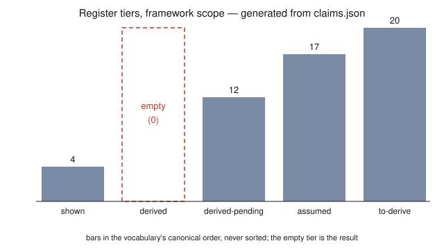

# Where the Responsive Vacuum Stops

*A negative-results report on a program that modelled the gravitational vacuum as a medium with memory, priced every assumption it took, and pushed until it stopped.*

D. Ryan Grover · 2026-08-18

> **Correction record, 2026-08-14.** Part I's first draft failed its mandatory hostile pre-screen (DO-NOT-SHIP): I.1 overstated two priority claims and contained a physics error in its gauge fence. The section was left standing under a do-not-cite banner rather than pulled, then corrected: I.1 is now one third its drafted length and claims nothing beyond the literature it cites; the register nodes that carried the same over-scoped clause were corrected **first**, with the source read (arXiv:2507.03103) that the register itself had flagged as owed. The full trail — draft, verdict, correction — is in the repository history.
>
> **Published in parts.** Complete as of 2026-08-18: the front matter, the note on the
> prior deposit, **Part 0**, **Part I** (corrected; see the record above), **Part II**,
> **Part III**, **Part IV**, **Part V**, **Part VI**,
> **Part VII** — except **VII.3**, which is left unwritten for its author — the appendices, and
> all three figures, each placed with its section (a fourth figure, the allowance window of
> Part III.2, was considered and refused there, on the grounds stated at that surface).
> **Outstanding:** VII.3 and the publication steps. The outline is fixed and lives in the
> repository; the sections not listed as complete **do not yet exist**. This line is updated
> at the close of every wave, and a document silent about its own completeness would be the
> last uncaught instance of the pattern this document is about.

---

## Abstract

**This is a negative-results report.** A framework treating the gravitational vacuum as an open medium with finite memory — one in-in (Schwinger–Keldysh) influence action, its response kernel decomposed on Barnes–Rivers spin projectors — was built, priced assumption by assumption, and pushed until it stopped. This document states where it stopped.

Three results outlive it, and two are not about this framework at all — one is a fact about general relativity, one about the in-in reduction of any open system. **First:** linearized Einstein–Hilbert is *not* transverse-traceless. Diffeomorphism invariance buys transversality but not tracelessness; the kernel is ½k²[P⁽²⁾ − 2P⁽⁰ˢ⁾], so the scalar sector survives the Ward identity at an exact ratio P⁽⁰ˢ⁾/P⁽²⁾ = −2 — which means the pure-TT ansatz this framework was built on is a **choice**, not a theorem, and it is priced as one. **Second:** the thermodynamic arrow decomposes — an open medium's arrow *exists* intrinsically, while its *direction* is imported from the bath's state, so the framework sharpens the Past Hypothesis rather than dissolving it. **Third:** the anomaly action that was supposed to fix the framework's one free parameter was computed and **fixes nothing** — it yields a scale, not a number.

The framework produced **no novel positive prediction**; the register's `derived` tier holds **0** entries. Its single decisive question — whether the assembled low-frequency spectral density ρ_TT(ω→0) = 2 Im G_R^TT of the *pure-graviton* de Sitter self-energy has a relaxation pole or a branch cut ([arXiv:2103.08547](https://arxiv.org/abs/2103.08547), [2107.13905](https://arxiv.org/abs/2107.13905), [2602.07908](https://arxiv.org/abs/2602.07908)) — was drafted as a one-page ask **and never sent**; later in-house work suggests it may be **ill-posed** in the formalism its intended readers use, since that corpus never reduces Σ(x;x′) to a time difference and so has no ω at all.

Two inflations are refused. The physics is not presented as a theory. The method — a claim register that prices assumptions and blocks derivations that quietly acquire them — is the more transferable output and is **unvalidated by anyone but its author**. A prior book by the same author, with a live DOI, describes a **different** framework and is substantially wrong; the note below says what and why the correction is owed rather than done.

**Every link in this program's verification chain except one human being is an AI — and so is the drafting of this document's prose.** The text was drafted by an AI instrument operated by the author, screened by other AI instruments charged with breaking it, and accepted by him; one section, VII.3, is reserved for the author's own hand and is unwritten here. That is stated in the front matter, at full volume, because a program whose audit chain is AI is more trustworthy for saying so than for letting the word "verified" do quiet work.

**Where to check any of this.** Repository: `github.com/ryangrvr/GRUT-RAI`, commit `f4ff2dfe16cb`, MIT licence — that commit holds the register, the calculations, the sealed instruments and the logs this document describes. It cannot hold this document or its figures, which are later work: a file cannot contain its own hash, so the pinned commit is necessarily an ancestor of what you are reading, and the published version's own commit is written in at deposit. **Check the hash against that repository, not against a working tree:** the rebuild is contributed by `git subtree`, which creates new commit objects in the destination, so the source tree cannot resolve them — a trap this program fell into and recorded (Part VI.3); the rebuild described here is the `rebuild/` subtree, and the prior lineage discussed below is retained in the same repository as historical record. The commands below regenerate every register-derived number in this document from a clean checkout; the four marked exception classes are attributed where they occur and no command produces them. The first three need only the Python 3 standard library; the fourth runs the suite under `pytest`:

```bash
cd rebuild
python3 provenance/validate.py                     # the register gate
python3 provenance/emit_public_numbers.py --check   # every count above, regenerated
python3 provenance/build_public_doc.py --check      # this document, re-rendered from source
cd provenance && python3 -m pytest -q               # the full suite
```

`rebuild/HOW_TO_VERIFY.md` gives the rest, including what a green run does and does not mean. The commits this document's argument points at — the regression that turned *commit* into *accept*, the audit that undercounted by eight *(that audit's own dated figure)*, the 12 occasions adversarial pressure removed a claim I wanted — are in that history, dated. **This work has not been deposited under its own DOI; when it is, this line will name it.** Independent researcher, no institutional affiliation; contact ryngrvr@gmail.com.

---

## If you read nothing else

1. **No novel positive prediction.** The `derived` tier is empty and a test fails if that changes without this sentence changing.
2. **Three results outlive the framework**, and two are not about it: the linearized-EH kernel is not transverse-traceless (a fact about general relativity — exact ratio −2, constrained sector); the arrow decomposes into intrinsic existence and imported direction, in every case surveyed (a fact about the in-in reduction of any open system, gravitational or not); and the anomaly action meant to fix the framework's one free parameter was computed and **fixes nothing** — it yields a scale, not a number. Part I.3 grades all three as careful restatements of standard material, not discoveries.
3. Its one decisive question — **pole or cut in ρ_TT(ω→0)** — was **drafted, held, never sent**, and may be ill-posed as posed.
4. **No outside physicist has answered any physics question put by this program.** Fixed point 2 states this checkably rather than as a denial.
5. **Every verifier in the chain but one human is an AI** — including the role the register calls "overseer," which appears **63** times in the register alone and named a *human* in this program's own glossary until the correction recorded in Part VI.3.
6. A previous book by this author, live under its own DOI, is **not this framework** and is substantially wrong. The correction is **owed, not done**.

---

## Six fixed points

**1 — Zero novel positive predictions; the `derived` tier is empty.** Of 53 claims in the framework's scope, the tier reserved for "follows from the foundation, derivation exhibited and checked" holds **0**. Populated: `shown` (4, standard physics verified against primary sources by the author), `derived-pending` (12, derived modulo a *named* open input), `assumed` (17), `to-derive` (20). The tiers are assigned by the author, alone.

**2 — No outside physicist has answered any physics question put by this program.** Stated specifically, because the general denial is unfalsifiable-sounding:

Of one term's occurrences, the register contains **28 records phrased as an external pass having run** — among them **6, across 5 nodes**, written as *SPECIALIST CONFIRMED* and *SPECIALIST-CORRECTED* and dated 2026-06-25. **No transmission to any outside human is logged at any date** — that half is checkable against the register in minutes, and an adversarial search of every file, log, git object and archived snapshot found none. That those passes were AI sessions run by the author is **not** established by the register, which never records modality; **it is the author's own statement, made 2026-08-12**, and the reader should treat the two halves differently: one is auditable, the other is testimony.

An audit of the word *specialist* found **49 occurrences across 18 of 74 claims** (58 if you count the 2026 annotation blocks that document them), classified: **28** phrased as a pass having run, **17** reserving a *future* expert, **2** generic or collective, **2** filenames. That word is not the only one that reads as outside authority — the register also uses *referee*, *reviewer*, *externally reviewed*, and *overseer-verified*. Appendix D gives the audit's classification scheme and its findings; the per-claim classification for the audited word is generated into `provenance/PUBLIC_NUMBERS.md`, and the audit's own result file — appendable, citing its sealed pre-registration by hash rather than being sealed itself — carries the aggregates and the rulings. The first version of this audit used one word and one letter-case; both narrowings are why the term list is now pre-registered before the audit runs.

**3 — A prior book with a live DOI describes a different theory.** Concept DOI `10.5281/zenodo.19803663`; latest version `10.5281/zenodo.20783057`. See the note below.

**4 — Every count the register produces is generated here, not typed; quoted figures are marked at the occurrence.** See the next section.

**5 — This is not the program's final deposit.** A signed termination condition schedules a closing document *after* a stop condition fires. **No stop condition has fired.** This document corrects a wrong live DOI — a different obligation — and changes nothing about what fires or when.

**6 — The name contains "Theory of Everything."** It does, on the prior deposit's title page. What that reaches for is left to the author, in his own voice, at the end of the body — see VII.3, which is unwritten as of this version.

---

## The one-number rule

No figure the claim register produces is typed into this document by hand. Each is a named placeholder in the source file, substituted by `provenance/build_public_doc.py` from `provenance/emit_public_numbers.py`; a test fails if the rendered text disagrees with a fresh run, **and a second test fails if any of those figures appears typed in the source** — as a digit, a spelled-out numeral, or a hyphenated ratio. That guard's coverage is derived from the emitter rather than hand-listed, because it was hand-listed until 2026-08-18, when a screen typed three emitted values into the source and the whole suite stayed green. Numbers this document quotes from elsewhere — the four exception classes below — are not generated, and the guard requires each to carry its attribution in its own clause rather than banning it. The rule exists because this program has published wrong counts twice: once through an audit pattern that silently dropped every capitalized instance of the word it counted, and once in the prior book, at scale.

**The exceptions, each marked where it occurs.** Numbers **quoted from the prior deposit** are that record's claims about itself. Numbers **cited from published literature** carry their source. Numbers from **the verification pass over the prior deposit** are that pass's findings, attributed to it. And numbers from **this program's own dated audit records** are those records' findings, attributed in place — historical events, not live register counts, and unable to go stale.

---

## A note on the prior deposit

A book by this author is live on Zenodo: *Grand Responsive Universe Theory GRUT ToE v4.0 — The Emergence of Everything — Candidate Framework*, deposited 2026-06-21, resource type **preprint**, latest of several versions under concept DOI `10.5281/zenodo.19803663`. **It is not the framework described here, and it is substantially wrong.**

It was not sloppy, and that is the point. Its own public description reads:

> *"Fully machine-checked. 121 registered claims across six tiers, over 3,000 gating tests, falsifiers attached — every reader-facing claim mapped to a registry tier, no HOSTED or OPEN result dressed as DERIVED."*

*(Those figures are quoted from that deposit; they are its claims about itself.)* That is this document's pitch, made first, by the same author, about a body of work a later verification pass scored **1-of-18 on its verifiable numbers, 0-of-7 on its falsifiers, and 1-of-11 on its scorecard rows** *(that pass's findings, attributed to it)*. A reader who notices I am promising machine-checked rigor twice is right to notice, and is owed the mechanism rather than an assurance.

**Here is the mechanism.** The tests tested the code. The register graded itself. Nothing in the loop was charged with trying to break a result before it was banked. Three thousand tests can pass against a register written by the same process that wrote the claims; a tier label is worth only the adversarial pressure applied before it is assigned, and there was none. The test count measured coverage of machinery, not scrutiny of physics.

**And here is what is different now, stated with its limits rather than as a credential.** A substantive result is surfaced by `provenance/bankgate.py` and then attacked by a separate AI session — run by me, from a clean context, instructed to default to *broken* — before I accept it. **That pass is not independent in the sense fixed point 2 requires:** same operator, same model family, no human in the loop but me. **And the gate reports rather than blocks** — it exits zero on a flag; it surfaces work for a firewall, it does not withhold anything by itself. Its only claim to bite is that it is charged against the result and its verdicts are recorded whether or not I liked them. 12 times in this document's own construction that pressure removed a claim I wanted; the occasions are listed in `provenance/construction_pressure.json`, so the number is emitted and the instances are inspectable. The register carries those verdicts as free text, not as a structured field — a gap, and the reason this is asserted here and only partly demonstrated.

What died with the book: an entire dark-matter substrate line; a two-anchor hierarchy ledger; a claimed unified no-go; and the whole `FORBIDDEN-BY-THEOREM` tier, which asserted impossibility results the framework had not established.

Two errors can be quoted from the book against itself. Its key-points list advertises a **32σ** exclusion *(quoted)*; this register's own recomputation of that quantity returned **2.0σ** (1.97 central), and found the mechanism it rested on had the wrong sign. The same list advertises a falsifier at **"689 Hz, zero free parameters"** *(quoted)*; that observable was later found to be energy-basis rather than position-basis — not a free-parameter question at all, so the falsifier as advertised does not exist.

**The remedy, stated as owed.** A version DOI is permanent by design: `10.5281/zenodo.20783057` will retrieve that text forever. What *can* be done is to deposit a superseding note as a new version under the concept DOI, so every citation of `10.5281/zenodo.19803663` resolves to the correction and points onward here. **That has not been done.** It is owed, it is mine to do, and until it is, the prior record stands uncorrected where most readers will meet it.

---

# Part 0 — Why anyone would model the vacuum this way

## 0.1 — The complaint against an inert vacuum

The quantum vacuum, as measured, is not inert. It polarizes: the effective electric charge runs with distance because the vacuum screens it, and the Lamb shift sits in the hydrogen spectrum — in the standard, ordering-dependent picture, because the vacuum's fluctuations move the electron. A force between uncharged plates — Casimir's — is measured to high precision, though whether it measures vacuum energy or the plates' mutual polarization is itself argued (Jaffe 2005) — a caution worth remembering every time this Part leans on an analogy. And an accelerated detector is predicted to find the vacuum thermal — the Unruh temperature, standard but unobserved. All of this is standard physics — the first items textbook QED, the Unruh prediction free-field theory for accelerated observers — and the measured effects are uncontested, whatever their interpretation: the vacuum, as measured, responds.

The question this program asked is one step further. Elsewhere in physics, response comes tied to dispersion and — somewhere in its spectrum — to loss. The textbook dielectric polarizes instantly; every real dielectric has dispersion — its polarization lags the field, carries a memory of it, and dissipates. A viscoelastic solid is the mechanical version: it pushes back like a spring at short times and flows like a fluid at long times, and the connection between the two behaviours is a memory kernel. Instant, lossless response — response with *zero* memory — is an idealization no measured medium realizes exactly: response comes with dispersion, and dispersion — by Kramers–Kronig — with absorption somewhere in the spectrum. The complaint against an inert gravitational vacuum is simply that "inert" asserts the zero-memory limit exactly, for the one case where it is checked far less stringently than in any laboratory medium — binary-pulsar damping and GW170817 bound it; they do not probe it as a dielectric is probed.

What is that analogy worth? One thing only: a question precise enough to fail. An analogy between the vacuum and a viscoelastic medium licenses no conclusion about gravity — media are made of parts, and whether the vacuum is "made of" anything is exactly what nobody knows. The entire worth of the intuition is whether it can be turned into a definite mathematical object with a definite parameter space and definite exclusion rules, so that the world can say no to it. Part II writes that object down; Part III reports where it stopped.

The idea itself is not new, and that comes first. Sakharov (1967) proposed that gravity is not fundamental but *induced* — the metric's stiffness an effective elasticity of the vacuum, paid for by the matter content at high energy. Jacobson (1995) derived the Einstein equation as an *equation of state*, thermodynamic rather than fundamental, from horizon entropy and the Unruh temperature. The analogue-gravity program (Unruh's sonic horizons onward; Barceló–Liberati–Visser for the survey) exhibits laboratory media — flowing fluids, condensates — in which effective metrics and horizons demonstrably arise, and Hawking-like radiation is reported, its thermality still argued. (The lineage citations here carry the same verification scope as Part I's priority references: verified through secondary literature, not read in original.) A vacuum that behaves as a medium is a decades-old hypothesis; the lineage above is its record. What this program put on top of that lineage is not a new idea but a bookkeeping discipline — every assumption priced, one of them late, caught by the program's own screen; every derivation gated — and whether *that* was worth anything is Part VI's question, not this section's.

## 0.2 — What a memory would buy

If the gravitational vacuum relaxed with finite memory, three things would follow — and each is stated here as a hope, a direction of search, not a result.

A cosmological constant that is not constant: late-time acceleration as a medium still relaxing, its slow approach to equilibrium doing the work the bare constant does in the standard picture. A structural home for gravitational dissipation: an open medium's response and its noise are locked together by the fluctuation-dissipation relation everywhere in equilibrium physics, so gravitational-wave damping and gravitational noise would arrive as one package with a defined shape, wherever the medium is near equilibrium, rather than as free inventions. And a setting where the arrow of time's machinery becomes load-bearing: an open medium *has* an arrow, and a framework built on one must say precisely where that arrow comes from — an obligation Part I.2 reports in full.

That is the hope, in full. The parts that follow report what pursuing it produced: no novel positive prediction, several exclusions, and a small number of results that outlive the framework — most of them results *about the hope's own limits*.

## 0.3 — What it costs before anything is derived

The entry price — most of it paid up front, the last items priced late, each after the program's own screens caught something being consumed unpriced: the division of the world into a slow metric and a fast bath; the restriction of the bath's influence to Gaussian order; the background's causal structure, taken as given; the covariant availability of the gauge-orbit identity that late-caught theorem leans on (the theorem is Part II.1's); and the background's time-translation flow — the presupposition that lets a response kernel be written at a single frequency at all, which the framework had been using since before it had a register and which nothing declared until 2026-08-18. Each is a named input booked under the founding ledger entry (`rung1_inin_action` in `provenance/claims.json`); none has a derivation exhibited from anything above it; the last carries an explicit condition for its own retirement. Everything claimed for the framework below is downstream of that purchase, and no framework result is stronger than it. Part I's two results are the deliberate exception — they hold whether or not the purchase was worth making.

---

# Part I — Two results that outlive the framework

Most of what follows this Part is about a framework that stopped. This Part is not. The two results here are about general relativity and about open-system irreversibility, and they hold whether or not the responsive-vacuum framing is worth anything. They are also, both of them, **careful restatements of standard material** rather than new physics — that claim is made explicitly in I.3, and the reader should hold me to it while reading I.1 and I.2.

---

## I.1 — General relativity's own response kernel is not transverse-traceless

> **In one paragraph.** When you write down how spacetime responds to being disturbed, the response splits into pieces labelled by spin. It is tempting, in model-building, to keep only the spin-2 piece — gravitational waves have two polarizations, so a "purely gravitational" response ought to be purely spin-2. That reasoning is wrong, and general relativity is the counterexample: linearized Einstein–Hilbert's own kernel carries a scalar piece alongside its spin-2 one. A model that keeps only spin-2 has made a **choice**.

**Everything in this section is standard material, and this time that sentence is the section.** The spin-projector decomposition is Barnes (1963) and Rivers (1964), applied to linearized gravitation by van Nieuwenhuizen (1973), routine since Stelle (1977). The kernel of linearized Einstein–Hilbert in that basis is the standard form ½k²[P⁽²⁾ − (d−2)P⁽⁰ˢ⁾] with P⁽⁰ˢ⁾ = θθ/(d−1) — in four dimensions, a scalar-to-spin-2 ratio of **−2** — and its scalar coefficient is precisely what produces the textbook conserved-source exchange T·T − ½T², so it is observationally load-bearing: it fixes the Newtonian normalization and the light-bending ratio, while **carrying no radiative degrees of freedom** — the physical spectrum is exactly two helicities. The scalar-channel-on-or-off question is likewise old ground: Stelle's R² coefficient switches the spin-0 channel on independently; Weyl-squared gravity is the standard case where it is zero *with a symmetry argument supplied*; ghost-free non-local gravity treats the spin-0 form factor as an independent function. This program's own computations of the −2 are **transcription checks against that literature, twice, in exact rational arithmetic** — not the source of the number.

*(Attestation: the priority references above were verified for existence, authorship, journal and year through secondary literature; I did not read the originals. An earlier draft of this section claimed two narrow novelties on top of the textbook material. A hostile pre-screen — run under this program's own mandatory rules — found both overstated and found a physics error in the section's gauge fence; the corrected account is in the repository, and the register's own nodes now carry the correction. The details are Part VI's material: the short version is that a symmetry restriction this framework's documentation attributed to the Ward identity turns out, per Salcedo–Colás–Dufner–Pajer's open-gravity construction, to be partly a choice — which makes the sentence below stronger, not weaker.)*

**The one thing this section is for:** the framework this document describes was built on a purely transverse-traceless response kernel. Nothing above forces that — general relativity's own kernel is the counterexample, and the open-gravity operator space is wider still. So the register prices the TT ansatz as what it is: **a declared assumption, costing one entry in the ledger, inherited as a conditionality by every result that leans on it.** The interrogation that established this was commissioned by this program against its own framework, and the answer — *chosen, not forced* — made the framework weaker and the register more honest.

## I.2 — Where the arrow of time is imported

For an open quantum system reduced from time-symmetric microscopic dynamics via the closed-time-path influence functional, the thermodynamic arrow splits into two logically separable parts.

**Existence is intrinsic.** The influence functional of a Gaussian bath yields a retarded dissipation kernel and a noise kernel with: a retarded, analytic self-energy (causal, analytic in the upper half plane); a positive Källén–Lehmann spectral measure; and a positive-semidefinite noise kernel. These hold operator-identically — they need no assumption about the *system's* initial state. So *that* dissipation occurs, and its *magnitude*, are genuine outputs of the formalism. This is the strongest defensible version of the "intrinsic arrow" claim, and it is real but narrow.

**Direction is imported.** None of that fixes the *sign* of relaxation. The direction is set by low-entropy data on the **past boundary**, in three interchangeable guises that reduce to one initial-condition assumption:

1. **the past-endpoint contour convention** — where on the closed time contour the density matrix is specified;
2. **passivity of the bath state.** By Pusz–Woronowicz (1978), a thermal (KMS) state with positive inverse temperature *is* passivity *is* "no work extractable" *is* the second law as a property of the state. The sign of that inverse temperature alone decides damping versus anti-damping; a legal population-inverted state **reverses the arrow**. Spectral positivity never fixes this sign;
3. **factorization of the initial system-bath state** — the quantum *Stosszahlansatz*. In the Nakajima–Zwanzig construction the closed dissipative master equation is literally a deletion of the initial correlations; irreversibility is generated by that choice.

### The exactly-solvable demonstration

`calc/arrow_origin.py` makes this concrete on the independent-boson (pure-dephasing) model with a super-Ohmic finite-memory bath, where the decoherence function is closed-form. It exhibits, exactly:

- **Time symmetry of the dynamics** — the decoherence function is even in time, identically. The equations of motion pick no direction.
- **Reversibility** — with finitely many modes the coherence decays toward zero and **returns to exactly one** at the Poincaré recurrence time.
- **The continuum limit as an assumption** — the recurrence time grows with mode number; a monotone, irreversible decay exists *only* in the many-mode limit.
- **Initial-state dependence** — the decay rate is set entirely by the assumed bath state.

So on a model where every step is visible, the arrow lives in the factorized low-entropy initial state and in the continuum limit — both assumptions, neither a consequence of the dynamics.

### Scope, and the ceiling that closed

Asked whether the direction tracks the sign of the inverse temperature *alone*, the honest answer is **no**, and the over-general version must be demoted:

- **Within the equilibrium class:** yes — the detailed-balance direction is fixed by that sign, and its positivity is the imported low-entropy input.
- **Outside it** (squeezed, driven, active, non-thermal baths): there is no single temperature; noise and dissipation decouple, and the system relaxes to a non-equilibrium steady state whose direction is set by the full generator.

Either way the direction is set by the assumed reservoir state, never by the time-symmetric dynamics. The ceiling is closed **within the cases surveyed** — a scoped result, not a universal no-go. One tightening runs against the result and belongs with it: even the "intrinsic" positivity above is established relative to a passive reference state, so the passive-state assumption co-supplies part of what looks dynamics-intrinsic. **The import is more total, not less.**

### What this is not

**It is not a solution to the arrow of time.** It is a decomposition plus a triangulation: three apparently different choices — contour, passivity, factorization — are one initial-condition assumption, and no surveyed derivation escapes it. Bogoliubov's weakening-of-correlations and eigenstate-thermalization/typicality arguments **relocate** the input; they do not remove it. The contribution is to say precisely what must be assumed and where, and to refuse to let it enter disguised as something dynamical.

### The framework corollary, last

In the responsive-vacuum program the equilibrium constraint is enforced as a hard admission gate that every candidate response kernel must pass. That gate — built as a *discipline* mechanism, to stop unphysical kernels — is *exactly* the object where the direction enters. The program does not bury the Past Hypothesis; the discipline machinery and the imported assumption turn out to be the same gate. That is a tidy fact about the construction and nothing more; sections above it do not depend on it.

---

## I.3 — Why these two are different in kind, and what neither of them is

The two results differ in what they are about. I.1 is a fact about **general relativity** — an exact statement about the structure of a kernel that exists whether or not anyone builds an open-system model on top of it. I.2 is a fact about **a formalism** — the in-in reduction of a bath — and applies to any open quantum system, gravitational or not. Neither is a fact about the responsive vacuum. That is precisely why they are in this Part: they are what remains if the framework is wrong.

**And now the demotion, before a referee supplies it: both are careful restatements of standard material.**

I.2 says so about itself in its own source document, and has from the beginning: *"This is not a solution to the arrow of time."* Every ingredient — Feynman–Vernon factorization, Poincaré recurrence, Pusz–Woronowicz passivity, the Nakajima–Zwanzig deletion — is established work by other people. What is offered is the *organization*: the claim that three assumptions are one, and the refusal to let it hide.

I.1 is demoted further than I.2, because its pre-screen demanded it: the section now claims **nothing** beyond the literature it cites. Its first draft claimed two narrow novelties; the mandated hostile pass found both overstated — one refuted by Stelle's own organization of the scalar channel, the other inverted by Salcedo–Colás–Dufner–Pajer's result that dissipation necessarily breaks the doubled diffeomorphism symmetry — and found a physics error besides. The pre-commitment in the first draft read: *if someone shows me that consequence stated in the literature, the honest response is to cite them and reduce this section to a pointer.* Someone did — the program's own pre-screen — and this is the pointer.

So the correct grade for this Part is: **two clarifications, carefully made, of things the literature already contains** — one of which cost the framework a load-bearing assumption when it landed. Not discoveries. Useful anyway, and useful independently of everything that follows.

---

# Part II — The framework, written down

## II.1 — The premise as mathematics

> **In one sentence, for readers who skip this section:** the framework is a single quadratic influence action for the metric perturbation on a doubled time contour — a dissipation kernel and a noise kernel, each carried on the spin-2 and scalar tensor structures, a restriction that is a family-conditional theorem resting on one priced input, not a gift of the symmetries — and that action *orients* (a sign floor, x_diss(ω) ≥ 0 pointwise — never a value) its one free scalar ratio, x, without ever fixing it.

The system is the metric perturbation h_μν on a declared background, doubled in the in-in (Schwinger–Keldysh) way that open-system physics requires: one copy for each branch of the time contour, or equivalently an average field and a difference field. The bath — the vacuum's fast degrees of freedom, the metric's own fast modes included — is **integrated out and deliberately not specified**. It is the framework's priced frontier: the bath's one structural property that matters (the shape of its memory) is exactly the question the program drafted for outside help and never sent (Part IV).

The symmetries imposed are declared as an inventory, and nothing beyond the inventory is available: retarded causality; truncation at quadratic order; the system/bath division itself; the equilibrium (KMS) condition with matrix passivity — whose fluctuation-dissipation lock, noise tied to dissipation channel by channel, is that condition's *consequence*, the ledger's assumption-removing event, not a separate imposition; diffeomorphism invariance **with its corrected, narrower scope** — dissipation necessarily breaks the doubled diffeomorphism symmetry down to its diagonal (Salcedo–Colás–Dufner–Pajer), so the surviving identity buys transversality on one slot of the response kernel only, not the exhaustiveness an earlier version of this framework's documentation claimed; background homogeneity and isotropy with their inherited parity-evenness; and the Onsager pair symmetry. Linearized Weyl invariance is *not* on the list and not available — the framework imports the trace anomaly, which is the statement that Weyl invariance is broken.

At quadratic order, at fixed frequency and wavenumber, the action is then

    S_IF[h_r, h_a] = ∫ h_a · K_R · h_r + (i/2) h_a · N · h_a

— a retarded dissipation kernel and a noise kernel, each decomposed on the spin-2 projector P⁽²⁾ and the transverse scalar projector P⁽⁰ˢ⁾. Each channel's coefficient obeys: upper-half-plane analyticity (causality); the KMS lock in equilibrium, noise tied to dissipation channel by channel; and passivity — no channel may amplify at any frequency, with no cross-channel rescue. The restriction of *both* kernels to those two structures has a history: after the correction recorded in Part I it stood as a **declared restriction**, not a consequence; it has since been shown in-house to be a **theorem on the framework's own admissible family, conditional on one priced input** — the covariant availability of the gauge-orbit identity, the ledger's newest entry — with positivity doing the closing work the broken symmetry could not. The same positivity closes the spin-2 dissipation channel at spacelike momenta on the same family — the closure rides the same priced input, and tensor-sector spacelike support would require the medium frame the framework's covariant family excludes. Outside that family — noise decoupled from dissipation, non-thermal occupations — a strictly larger operator space exists (Salcedo–Colás–Dufner–Pajer's open-gravity construction) and is fenced at its point of entry. One structural conjecture remains deliberately open and labelled: that the memory is *finite* — a single relaxation pole rather than a branch cut. That is the framework's load-bearing conjecture, it is external, and Part IV is about it.

One anchor sets the scale: general relativity's own kernel, ½k²[P⁽²⁾ − 2P⁽⁰ˢ⁾] — its scalar component, twice the spin-2 one in magnitude, is Part I's first result made structural, and GR itself refuses the pure-spin-2 idealization. And the scalar modulus is given a name: x, the scalar channel's coefficient normalized to the trace-only endpoint — the configuration whose scalar channel couples to the trace alone (x = 1) — **declared a function of frequency and wavenumber rather than a constant**, because nothing in the program's corpus forces it constant and pretending otherwise would smuggle a dial.

The landing: **the action does not fix x.** What it forbids is real — anti-passive response in either channel at any frequency; noise detached from dissipation in equilibrium; acausal kernels. Two further exclusions have homes outside the action and are recorded at their own strength: the trace-only endpoint x = 1 at constant x, excluded by a partly empirical export (the register's `mu_linear` no-go), not by the action's conditions; and — held at to-derive by the register's own ruling, conditional on the single-pole conjecture this paragraph just declared open, and generic where it holds (Vikman 2005) — the statement that a single passive channel cannot cross the phantom divide. What the action itself does not forbid is recorded with equal weight: any amplitude of either modulus, any nonnegative value of x, any frequency- or wavenumber-structure compatible with the conditions above. The action carries a *family*. **Why nothing comes out of it, structurally.** The framework's commitment about memory is that it is *finite* — a statement about which class the response belongs to, not about how long it lasts. An audit of every register claim that touches the memory scale found no claim depending on its value: every live use is a limit (the zero-memory collapse that recovers general relativity), a class question (pole or cut), or a *different* scale — the slow cosmological mode, whose existence is priced as an inserted assumption and whose value is pinned to an observed quantity rather than chosen. So for anything carrying units, there is nothing in the commitment for a number to come out of: a class has no scale, and the framework asserts the class. **A dimensionless ratio is blocked by a different fact and the two must not be merged** — the scalar-to-tensor ratio x carries no units, so the argument above says nothing about it; what blocks *it* is that the admissible set is a cone closed under rescaling, so the conditions orient the channels and select no point in them, and the one computed route to a pin returned no pin as its output. Two distinct barriers, one for scales and one for ratios, and together they are why every route from this framework to a number runs outside it. That is not a gap beside the empty `derived` tier; it is the same fact one level upstream.

"Responsiveness" means exactly this list — a doubled rank-2 field, this inventory of symmetries, two kernel channels with these analyticity, balance, and positivity conditions, one adopted dimensionless axiom (α, the anomaly normalization, conditional-theorem grade), one open conjecture (the single-pole memory, external), one hand-chosen point (x = 0 constant — the pure-TT choice, priced in the ledger), and one unfixed function. Anything attributed to "responsiveness" that does not follow from that list is an insertion, and the register books it as one.

## II.2 — What it bets

The postulate map sorts every input by kind, and the sort answers "what is this framework actually betting?"


*Figure 2. The sort, by names rather than counts: equal boxes carry no claim about equal weight or equal number, and the left-to-right order is the map's presentation order, not a hierarchy. Membership is transcribed from `POSTULATE_MAP.md`, and a test fails if a name here is absent there.*

**Bedrock: posits that are not even candidates for derivation.** The medium ontology itself, with its division into slow metric and fast bath — the bet, and a framework must bet something. The low-entropy past boundary — Part I.2 is the demonstration that, in every case surveyed, the arrow's *direction* is imported rather than dynamical — so the framework imports it, priced. And the Born measure: decoherence machinery selects a pointer *basis*; it does not by itself supply the outcome *probability*; the probability rule is inherited. The discipline's claim about these is not "unsolved" but "un-derivable in every case surveyed" (Part I.2's scope): surveyed derivation claims relocate the input; they do not remove it — and counting a relocation as a removal is the laundering the register books (laundering — deriving with an input the derivation does not declare).

**Open layers: assumed today, each with a named path to discharge.** The bath's memory shape — pole or cut, the framework's one decisive external question. The pure-spin-2 choice — the symmetry route to forcing it is *closed* (Part I.1); a dynamical route through the bath survives, at the recorded cost that it would relocate the assumption rather than remove it. The general action carries x free; the framework's cosmology exports were computed at the hand-chosen point x = 0 — the pure-TT choice — and that point, not the family, is what this open layer names. And the covariant gauge-orbit availability — the entry booked while this document was in preparation, which is booked to retire into the operator basis's reserved covariant completion — the register's named placeholder for that work — if and when it lands, in-house or in the literature.

**Borrowings, with the loan recorded: things the framework does not host.** General relativity itself is *recovered with imports*, never derived — the memory-to-zero limit collapses the kernel to a local form, and the recovery leans on horizon area and the Unruh temperature, both priced. Each program surveyed pays somewhere: Jacobson pays with horizon thermodynamics, Sakharov with the high-energy matter content. And the anomaly-to-amplitude bridge — the hope that the trace anomaly would normalize the spin-2 response — is settled negative on sector orthogonality: the two anomaly coefficients live in different channels (the a-anomaly reaches the spin-0 channel only, the c-anomaly the spin-2 channel only), their ratio is the coefficient of neither, and no metric-built object carries it across.

**Results, never inputs.** The fluctuation-dissipation lock — an entry that *removed* an assumption (the register's negative ledger event, `rung2_kms_gate`); the lock itself now derived-pending, leaning on the background time-translation flow, an assumed input — the removal stands in the ledger, the conditionality stands on the node. Linear cosmology in the ΛCDM shape — held not by derivation but by a partly empirical exclusion the framework exports against its own naive modification; derived-pending, leaning on the pure-TT point and carrying that conditionality. The no-crossing statement — a single passive channel cannot cross the phantom divide (the second law fixes the side, not the slope) — held at to-derive, gated on the single-pole question, generic where it holds (Vikman 2005). And the dissolved-screen negatives: several of the program's own founding hypotheses, screened and returned as derived no-results rather than as claims. The map's reading rule: a bedrock item claimed as derived is laundering; an open layer that graduates is a real ledger event; a borrowing sold as hosted is an over-claim; a result counted as an input is the category error the register's gate exists to catch.

One sentence for the whole bet: **a medium taken at Gaussian order on a given causal background, a boundary condition, and a measure — everything else is either open with a named discharge, borrowed with the loan recorded, or output.**

## II.3 — The whole story, with the holes marked

The register's story is authored where it must be and generated where it matters: the stage-to-claims mapping is the construction — authored — and every link's status is computed from the claims, not narrated over them. The chain, from origin to observers, at a glance — the status marks exactly as generated:

> origin → medium → persistence → arrow ∥ thermality → gravity → quantum → classicality ∥ structure → dark energy → matter (SILENT) → observers (UNPOSED)

The marks are the content. Two pairs of links are *concurrent* (∥) because forcing them into sequence would be a readability lie: the arrow and thermality are one fact doing two jobs, and decoherence of cosmological perturbations happens *during* structure formation — the two do not cleanly separate. One link is **SILENT**: no node in the framework's scope books the Standard Model's spectrum or couplings as a claim — the chain's matter link (persistence's far neighbour) is empty, and the chain says so in capitals rather than tidying the hole away. One link is **UNPOSED**: how observers arise has never even been asked in the register, and the chain ends by admitting it.

What the generated statuses show, read as a whole: the original content clusters in the middle. The memory kernel, the fluctuation-dissipation lock, the arrow decomposition — the links where the open-system toolkit actually grips — carry the program's own contributions. Both ends are borrowed or empty: the origin link is pure import (the past boundary), and the far end is silence. The framework is a **middle-of-the-story framework**, strongest exactly where dissipation, memory, and detailed balance do work, empty where they have nothing to hold.

And one structural fact the chain surfaced: the story's strongest joint — the node shared between the arrow and thermality links — is the same node as the ledger's assumption-*removing* entry (`rung2_kms_gate`). The place where the narrative is most load-bearing and the place where the accounting ran negative coincide. The shared node is the authored mapping's; its negative ledger entry is the register's — both halves are checkable.

The chain also keeps its own books: every claim in the framework's scope (the GRUT nodes) is either placed in a link or listed off-chain with a reason, and the generator errors if one goes missing. The full artifact, statuses and all, is `EMERGENCE_CHAIN.md` in the repository, regenerated on every register change; this section is a reading of it, and where the two disagree, the generated artifact wins.

---

# Part III — Where it stops

**Every entry in this Part is a statement about the framework as written, not about nature.** That sentence governs everything below and is promoted here, to the chapter head, so no boundary can be read as a discovery about the world.

## III.0 — How to read a boundary

A boundary on your own model is a debugging note. It says: *this construction, with these declared inputs, cannot reach that place* — and nothing about whether the place exists. Debugging notes are what a biting gate produces — though whether *this* gate bit is not assertible from here: the earned strengths on each entry below, and the pressure record in III.3, are the checkable evidence either way. That is why this Part sits inside the physics rather than in an appendix of caveats: the boundaries *are* the output.

They come at distinct earned strengths, and the strengths are not interchangeable. The strongest label the ledger defines — **FORBIDDEN**, a structural impossibility within the framework's axioms — **is banked by nothing in this register.** Say it in the legend, because the absence is load-bearing: the strongest exports here are *settled-negative* (no known route, a strong obstruction, a named rescue left open), *excluded* (killed by data plus structure, not impossibility), *invisible-by-suppression* (real but unobservably small), and *borrowed* (not derivable from this machinery; imported and marked). One further label appears below — *not earned*, an economy claim unavailable at the framework's current strength, classed with settled-negative and carrying a named rescue. Over-grading a no-go — promoting an obstruction to an impossibility — is the exact failure mode this program polices, and the prior deposit committed it with an entire tier.

## III.1 — The containment results, entry by entry

Each entry below is transcribed from the no-go ledger (`NO_GO_LEDGER.md`) at its earned strength, names its register home and tier, and ends with what it imposes on any completion. The tiers matter as much as the strengths: several boundaries are themselves held open by the register — a boundary can be no better established than the claims it stands on.

**The anomaly-to-amplitude bridge — SETTLED-NEGATIVE, not forbidden.** The hope that the conformal-anomaly ratio normalizes the spin-2 response amplitude is settled negative on a primary obstruction of sector orthogonality — computed, exact: the a-anomaly reaches the spin-0 channel only and the c-anomaly the spin-2 channel only, so the ratio α = a/c is a ratio of coefficients living in *different* channels and the coefficient of neither, and no metric-built scalar-to-spin-2 intertwiner exists to carry it across — with independent Ward-identity and RG-protection obstructions behind it. The fluctuation-dissipation lock fails to rescue it (the would-be normalization cancels out of the lock), but that is a failure to rescue, not a fourth obstruction. The α *value* is untouched: a/c = 1/3 is standard physics as a conditional theorem — *if* the conformal mode is the response's infrared carrier, then α = 1/3 (`rung9a_value`, tier shown); what the framework adopts, axiom-grade, is applying that identification as its normalization. Only α's *role* as the kernel normalization is settled negative (`rung9b_bridge`, tier assumed, sub-status settled-negative). Impossibility in every extension is *not* claimed. **Spec for a completion:** supply a new operator identity — a legitimate scalar-to-spin-2 intertwiner — or accept the amplitude as an external input.

**The naive growth modification — EXCLUDED, a hybrid grade: structural plus joint empirical at the ~4σ-class weight attributed by the no-go ledger.** The super-horizon growth modification the framework's own conformal coefficient naively suggests is dead twice over: a separate-universe consistency argument (conditional on adiabaticity and a named dilatation bridge), and a joint empirical disfavoring — the recomputed cross-correlation tension at 2.0σ (1.97 central; the prior deposit's advertised figure in this channel is retired as impossible there) together with an independent lensing-amplitude tension at 3.5σ. The register home is `mu_linear`, tier **derived-pending** with an armed trigger: if the bath's trace (spin-0) correlator is established nonvanishing — closing the last route to deriving the scalar sector's vanishing — the tier demotes by its own recorded rule. The endpoint exclusion itself is p_tt-independent: it survives even if that trigger fires. What leans on the pure-TT point is the *surviving* statement — "linear cosmology in the ΛCDM shape," which holds given the chosen scalar coupling and is empirically *selected*, not derived. **Spec:** derive the scalar sector's vanishing from the action (the symmetry route is closed — Part I.1; only the bath route survives, at a recorded relocation cost) or accept the choice as an input.

**An economical evolving dark energy — NOT EARNED.** A single-parameter evolving equation of state matching DESI's evolving-w evidence is not available to a single passive relaxation channel: one passive mode stays on one side of the phantom divide — the line w = −1 that the data's preferred history crosses — (generic where it holds — Vikman 2005 — and conditional on the open single-pole conjecture; the register holds the no-crossing at tier **to-derive** across its homes `rung7_wz`, `rung7_w2_wa_sign`, `rung7_w3_nocrossing_export`, by its own ruling that a no-go cannot outrank its anchor). An earlier "wrong sign" reading of the evolution slope was retracted — the slope's sign is indeterminate at the current frontier, fixed by nothing yet banked; the second law fixes the *side*, never the slope. The framework's sourced statement is a flat equation of state at the divide; matching an actual crossing would cost a genuine second slow mode and the parameter that comes with it — which is the economy the claim was trying to keep. **Spec:** supply that second, cosmologically slow, sign-changing mode, and pay for it.

**The tabletop decoherence falsifier — INVISIBLE-BY-SUPPRESSION, quiet or faint.** The framework's qualitative wedge against collapse models — energy-basis rather than position-basis decoherence — is real as a distinction and fails as an observable: the dominant coupling commutes with the system Hamiltonian and samples the noise spectrum at zero frequency, where the framework's assumed bath spectrum vanishes (quiet); the wedge-carrying couplings survive, suppressed by seven to tens of orders of magnitude below current sensitivity (`calc/q1_energy_basis_magnitude.py`) (faint). Register: `rung8_falsifier`, tier **to-derive**. Observability would require staking the noise amplitude roughly ~10⁷× above its natural value at the current matter-wave bound — a tuned number. **Spec:** a leading off-diagonal energy coupling at order unity, or a bath resonance that lifts the magnitude; otherwise this falsifier cannot carry the program.

**Gravitational-wave dissipation as a signature — INVISIBLE-BY-SUPPRESSION.** The dissipative dephasing of gravitational waves is real — absent in lossless GR — and sits tens of orders of magnitude below any detectability threshold; the GW170817 speed bound is satisfied with room to spare. The suppression is the same Planck suppression that makes the framework solar-system-safe: a feature of the construction, not a tuning, and also the reason it cannot be seen. Register: `rung4_love_kk`, tier **derived-pending** (the kernel structure; leaning through the KMS lock on the background time-translation flow, an assumed input), with the magnitudes in `calc/gw_dissipation_bounds.py`. **Spec:** a bath resonance or collective infrared mode lifting the response into the live window — nothing in the corpus supplies one.

**Deriving general relativity — BORROWED.** The in-in machinery does not select the Einstein–Hilbert action; the diffeomorphism identity constrains conservation, not the action, and whole families of actions satisfy it. The recovery in the zero-memory limit leans on horizon area and the Unruh temperature, both imported and priced (`rung5_gr_limit`, tier **assumed**). On current footing the gravitational sector is a member of the emergent-gravity family, not a from-scratch derivation. **Spec:** the microscopic input that fixes the coupling and the derivative expansion without importing the area law — an open, hard program.

**Deriving the Born rule — BORROWED.** Integrating out the bath reproduces the Schrödinger core and selects a pointer basis; a preferred basis is not outcome selection, and the probability measure is inherited (`rung6_qm_limit`, tier **assumed**). The decoherence *rate* is a genuine output; the *rule* is a postulate the framework carries like everyone else. **Spec:** the outcome measure itself — decoherence is necessary, not sufficient.

That is the full list — nothing at FORBIDDEN, and saying so is part of the list.

## III.2 — The one empirical surface: a ceiling with no floor

Exactly one place in this framework is *actively bounded* by current data — a live parameter constrained from above, as distinct from an endpoint killed or a signature suppressed below any contact — and its shape invites misreading in both directions, so it is stated here with its qualifiers.

The pure-TT choice closed the naive scalar channel; the interior it foreclosed is now an explicitly parameterized family — the scalar modulus x of Part II, running from the pure-TT point to the excluded trace-only endpoint. The computed record on that family: the lensing bound admits the interior below a ceiling of roughly 0.59 in x — computed at central input values and read at the loose (conservative, upper) edge of the register's declared uncertainty fence — corresponding to a growth-modification allowance (μ−1) of up to roughly 0.20 at the edge. An owed calculation (the low-multipole temperature auto-correlation channel, estimate-grade today) is expected to tighten it, and it is the register's standing gate for any interior-viability claim above roughly 0.06 in x — compatibility above that mark is provisional on it. And the family has **no floor**: nothing in the framework, the register, or the data pushes x away from zero. The strongest attempt to draw one — the computed anomaly action, the abstract's third headline result — yields a scale, not a number (`calc/anomaly_c0_map.py`), so the floor stayed undrawn. The family *allows*; it does not predict.

That asymmetry is the central content of this surface, and both directions of misreading are live. Read as a prediction band, the allowance is a fabrication — there is no lower edge, so there is no band, and the corresponding figure is refused on exactly those grounds (a drawn ceiling over an undrawn floor reads as a band no matter the caption). Read as a null result, it is also wrong — the framework is *not* excluded on this surface; the tension the data does show (the lensing-amplitude tension at 3.5σ, independent of the retired channel) bounds the family from above and says nothing below. The honest sentence is unexciting: the interior family is compatible with current linear cosmology anywhere under its ceiling (provisionally, above the standing-gate mark, until the owed calculation lands), and the lensing-amplitude tension the ceiling comes from may itself be fully compatible with the framework — the register cannot yet say otherwise.

Two corrections sharpen this surface, both against the framework's convenience. First, x is not a number. The action declares it a function of frequency and wavenumber, and nothing in the corpus forces it constant; every "one free parameter" description — this document's own abstract included — therefore *understates* the freedom, and the constant-x window above is a one-dimensional cut through a function space — every number quoted on it carries that cut-conditionality, recorded in the register. Second, the boundary's flagship version was demoted by the program's own audit: the sharper bound once derived in the low-multipole temperature auto-correlation channel is family-conditional and contaminated by the very insertion it tested, so the loose reading above is what survives. The ceiling is real; everything sharper is conditional.

## III.3 — The times the machinery fired against the author

The boundary list above is only as credible as the pressure that shaped it. This section is that pressure's record — the pressure being the program's own AI screens, run by its author from clean contexts — inside the physics Part on purpose: these occasions are the reasons to believe III.1 says what the register says rather than what its author wanted. The occasions are data (`provenance/construction_pressure.json`) — the front matter's count of them is emitted from that file, and each is checkable. All are from this document's own construction. They are told in one tone, in order.

**The independence claim.** The author wrote that the program's adversarial passes are "independent." The hostile pre-screen removed it: the passes are the same operator, the same model family, no human in the loop but the author — precisely the credential the front matter spends a paragraph refusing. The document now says so instead.

**The blocking claim.** The author wrote that results are attacked "before they may be banked." The pre-screen, checking the claim against the gate's own code, removed it: the gate exits cleanly on a flag — it surfaces work, it does not withhold anything. The phrasing implied a lock that does not exist, and the mechanism section now states what the gate actually does.

**The no-typed-counts claim.** The author wrote "no count in this document was typed by hand" — and the claim was falsified inside its own paragraph, where spelled-out numerals and hyphenated ratios had walked past a guard that checked bare integers only. The guard was rebuilt to see word-forms and ratios, and the rule's statement now names its enforcement and its exceptions.

**The attribution claim.** The author wrote that the register's authority-flavored records "all trace to sessions the author ran himself." The adversarial search removed the claim as stated: the register proves the *absence of a logged transmission* and never records who or what ran a session — so the second half is the author's testimony, and the document now labels it as testimony rather than as a checkable fact.

**The priority claims.** The author wrote a first draft of Part I.1 carrying two novelty claims and a gauge argument. The mandated pre-screen returned do-not-ship: one novelty was inverted by published work the register itself had flagged as owed reading, the other was refuted by the cited literature's own organization of the material, and the gauge argument transcribed a fact from one setting into another where it is false. The register was corrected first; the section shrunk to a third of its drafted length and now claims nothing beyond the literature it cites; the trail is in the correction record at the head of this document.

One caution about reading the pattern: the file's own admission rule guarantees the direction — an occasion enters only when a pass removed a claim the author wanted — so the consistency is the selection criterion, not a finding. What the record evidences is existence, number, and checkability: the machinery fired, repeatedly, on this one document's construction, and each firing is inspectable. A gate that only ever confirms is decoration; the record, not the assurance, is the evidence that this one does not.

---

# Part IV — The question that was never sent

## IV.1 — The conjecture, and what it gates

The framework's one load-bearing structural conjecture is that the vacuum's memory is *finite*: the tensor response has a single relaxation pole rather than a branch cut. Register home `rung3_single_pole`, tier **derived-pending** — neither derived nor refuted, and the register's own grading of its best argument is the reason this Part exists.

That argument runs: commit to relativistic massless fast modes and the bath's spectral density is super-Ohmic; super-Ohmic baths are short-memory — *within the collisional regime, and provided the bath carries no second internal dynamical scale*, both provisos the register states — and short memory collapses the kernel to a single pole. The register carries this with its circularity on its face: whether the vacuum's bath is in the collisional regime is exactly the pole-versus-cut question, so the named open input is the regime membership itself — which is the conclusion; that is the circularity. The register's phrase is **"favorable-but-circular,"** and the conjecture is held as the *anchor* accordingly — a role in the ledger, not a tier: the one open input the whole transport sector (the bath-and-memory machinery) funnels through.

What funnels through it is most of Part III: the dark-energy channel's no-crossing statement is conditional on it (a no-go cannot outrank its anchor); the growth-exclusion's armed trigger rides the same dispatch (the bath's trace correlator — a *different* sub-question than pole-versus-cut, and the register keeps them distinct); the passivity floor's static transfer — the in-house attempt to carry the per-channel sign floor from finite frequencies down to the static modulus that observables couple to — is conditional on the kernel class it would decide; and the interior family's one escape from being a choice — deriving the scalar sector's vanishing dynamically — runs through it at a pre-priced relocation cost. It is the framework's single point of maximum leverage; it has not been decided in-house — the push stopped at two named blockers, neither a no-go — and the register grades it external. The honest description of its current state is the arc below.

## IV.2 — Where the fork sits: a localization, superseded by its own correction

The program once located the decisive fork at second order in the gravitational coupling. The argument: at first order the tensor mode function is frozen — no response — so the leading tensor dissipation could only enter at the next order. That localization **rested on the frozen-tensor premise, and the program then corrected the premise against itself**: the freezing result holds for *scalar-loop* sources only; for graviton-self-loop sources the gauge-fixed kernel is demonstrably nonzero and carries a position-space logarithm — whose time-domain secular status awaits an integration the source's own epilogue lists as not done, with secular growth corroborated so far only in companion mode-function results (the correction is recorded, dated, at the head of the calculation that had used it, and the calculation record's erratum discipline kept the superseded body unedited beneath it). **Where the graviton-loop fork sits is therefore open and uncomputed** — nothing establishes the second-order localization for the case that matters, and this document does not work that case.

What survives the supersession, stated with it: the *dictionary* connecting a late-time secular envelope to a low-frequency singularity class — exact, closed-form, and verified by self-test to a relative error the calculation's own record states (`calc/rung3_spectral_structure.py`) — and the **fence**: a mode frozen at first order means the register is *silent* there — silence is neither the pole class nor the cut class, and reading absence-of-growth as either is the conflation the dispatch's technical brief names among its kill-conditions — its pre-registered ways the argument dies — and the calculation record fences in its own words: silent at first order, both horns live. The dictionary is a tool awaiting a legitimate input; the localization that once fed it is gone.

## IV.3 — The arc


*Figure 3. The three candidate answers, on identical axes and at identical amplitudes — the amplitudes carry no weight claim, since these are mutually exclusive candidates for one undetermined object and no normalization exists to compare them. The order is not a ranking; each panel carries its status in the register, including that the framework's own conjecture is the first panel and the known free-field structure is the third.*

Documents with different authority speak in this section, and the difference is the section's subject, so it is stated up front: the *register* grades claims; the *event log* (`provenance/prereg/RESULT_TERMINATION_events.txt`, dated, append-only) records events and carries the question's channel line; the *sealed condition* alone governs what resolves or stops; and the *dispatch's face* carries its own status. The question's whole decision history is that log, this section is a reading of it, and where the two disagree, the log wins.

The ask was drafted as one page — the assembled low-frequency tensor spectral density of the pure-graviton de Sitter self-energy: pole or cut — with a technical brief attached, an audience of record named (the two author groups whose published work defines the object), and a termination condition sealed alongside it — by its second version, every channel carried an explicit still-open outcome. The condition went through sealed versions: the first was superseded after adversarial review passes found structural gaps (the log records that cause in those words); the second gave way to a one-page rebuild after a third draft, never sealed, was retired as the record of the maximal-architecture attempt; and the rebuild was drafted against a *pre-sealed gate* whose no-repair rule bound it to ship exactly as it passed. It passed on its single pre-registered *internal* adversarial pass, and was signed into force on 2026-08-10. The signing entry itself records, without repairing, a seam the external adversarial read (an AI session, like every reviewer in this program's chain) had found after the gate pass — the no-repair rule governing even the signature — and the signature block misspelled the signer's own name, corrected two days later as a clerical entry because the append-only rule forbids editing the record even for orthography.

The same day the condition entered force, two entries were imported from an offline session copy of the log, verbatim, defects included — the second is the in-house assembly attempt described below; the first carried the heading **"DISPATCH SENT; REPLY RECEIVED."** What had actually run — the log's subsequent clarifying entry states this descriptively, on the author's own account relayed into the log ("the owner" is the log's word for the author) — was an AI literature-research tool operated by the author: an in-house instrument, the same class as the in-house work it sat beside. The canonical record contains no transmission to the audience of record; the signing entry of the same date says the dispatch remains unsent; the heading described a tool run. The channel verdict inside the imported entry — still open, no stop trigger fired — was correct and stands; its heading was wrong and is corrected *by* the record rather than *in* it. The false heading is still on the page, followed by the entry that unmakes it.

Around the same dates, the program pushed the question in-house until it stopped at two named blockers, neither a no-go. The attempt identified the exact gauge-fixed object the ask points at — it exists and has a name in the audience-of-record's own papers — and established that for graviton-self-loop sources it is nonzero, carrying a position-space logarithm — and nonzero alone is what closed the frozen-tensor escape and superseded the localization of IV.2. The blockers it stopped at: the gauge-invariant assembly exists only for a scalar probe, and the resummation tool's completion is deferred by its own authors — the attempt sharpened the ask; it did not substitute for it. A first version of that write-up then took a run of source-verified corrections in one erratum — a category mislabel, an in-out-versus-retarded misidentification, an inverted claim about coincidence-limit tables, and a position-space logarithm read as time-domain secularity — each pinned to page and equation, the body retained unedited beneath them. A third-outcome flag (a double-logarithm reading pointing at an entire-function endpoint) was raised and then **retired on its face** when source verification killed its premise twice over — retired, not deleted.

Then the literature pass found the deeper problem. The ask fixes its frequency variable conjugate to cosmic time — and across the audience-of-record corpus (roughly two hundred pages: the log's own audit figure), the log's full term list — *frequency*, *ω*, *Fourier*, *spectral*, *retarded*, *pole*, *branch cut*, *damping* — scores zero, for the log's stated structural reasons: that formalism never reduces the self-energy to a time difference; its leading-logarithm truncation trades the two-time kernel for a local equation in the e-folding clock; and its stochastic band moves with absolute time. The ask's central object has no meaning in the framework its intended readers use. **As posed, the question may be ill-posed** — not unanswered but unanswerable in that form. A well-posed static-patch substitute exists as a recorded candidate: there, frequency is the boost eigenvalue, the free graviton response is known in closed form — meromorphic, a gapped tower of poles rather than a single pole — and published work shows a branch cut is what a line of such poles becomes in a limit. Nobody has computed the loop correction that would move the tower. The dispatch is marked **HELD — do not send as written**, with this reason on its face, and no clock of any kind attached to its channel has started.

That is the arc: a question drafted to be falsifiable was instead caught, by the program's own instruments, possibly not being a question. The channel line in the event log reports it still open — its cause, on the log's latest entries: unsent, and possibly ill-posed as stated, with a well-posed static-patch substitute recorded. That line is the log's, quoted at its own strength; nothing in this section is the register's assertion.

## IV.4 — It was never sent, and the records that said it was

The claim "this program's decisive question was put to outside experts" would be the single most authority-borrowing sentence this document could contain. It is false, and at moments the corpus asserted it. Per this document's rule for its own defects, the records are quoted verbatim rather than summarized — each is the program's own text, quoted against it.

The event log's imported heading, with its unmaking entry:

> "DISPATCH SENT; REPLY RECEIVED" — *followed, same file, by:* "The imported heading 'DISPATCH SENT' describes the tool run, not a transmission to the dispatch's recipients"; "the operative words quoted in that entry … are output of an AI literature-research tool operated by the owner … not a communication from either of the two author groups that C1's own text names as the audience of record"; "the dispatch remains unsent as of this entry"; "no entry since records a send to either author group."

The in-house assembly write-up — the file whose purpose is to record that the work was in-house:

> "the thing DISPATCH_ONE_PAGE.md was sent out" — *corrected in place, 2026-08-12:* "THE DISPATCH HAS NEVER BEEN SENT … The error sat in the very file whose purpose is to record that this work was in-house."

The stage-close document:

> "one dispatched physics question" — *corrected 2026-08-12 to:* "one physics question **drafted as an ask and never sent**."

And the register-generated story's persistence link:

> "dispatched, unanswered" — *corrected 2026-08-12; the chain now reads:* "DRAFTED AS AN ASK, HELD, NEVER SENT."

Each correction is dated in place. The pattern these records share is the one the authority-vocabulary audit later formalized: a claim of outside contact does not need to name an authority to make one, and a frozen term list built from *authorities* missed every claim of an *act*.

## IV.5 — The ask, restated

For any reader positioned to answer it, the question is restated here in the corrected, held form — third person, as a description of what the program would still like to know rather than a transmission of it.

The program maintained by D. Ryan Grover asks whether the gauge-invariantly assembled, infrared-resummed, low-frequency tensor spectral density of the pure-graviton one-loop de Sitter self-energy has a single-pole structure or a branch cut. The gauge-fixed kernel exists in the published literature and is named there; the two missing pieces are named too — a graviton-probe version of the existing scalar-probe gauge-invariant assembly, and the completion of a resummation tool its own authors defer. The program's in-house finding is that the question *as frequency-posed may be ill-posed* in the formalism its natural audience uses, and that the well-posed substitute is plausibly a static-patch one: whether the one-loop correction moves the known free gapped tower of graviton quasinormal poles toward or away from a single dominant relaxation pole. A pole-class answer would earn the framework's core structural assumption at one loop and make its remaining free scale computable in principle; a cut-class answer refutes it as stated, and the program's ledger is built to take exactly that outcome. A third clean outcome is equally decisive, per the dispatch's own text: if the same assembled kernel's scalar sector is locked to the GR ratio by a constraint identity, that is a protecting-symmetry result the program equally wants to know — it is the scalar-sector fork the second table below prices. Any of these is publishable stand-alone de Sitter physics, with the program's use of it downstream and attributed.

## IV.6 — The decision table

Published in advance of any answer; the pre-commitments that bind are the register's dated cells below — the rows' vocabulary postdates the in-house record and binds nothing. **This table is descriptive and changes no trigger**: the sealed termination condition (in force, signed 2026-08-10) alone says what resolves its channels and what stops in-house work. Under it, only a reply asserting the pole class or the cut class *in its own words, unconditionally* resolves the question's channel; every other row leaves that channel still open with its cause stated. **Outcomes reached in-house land in these rows and touch no channel** — the rows say meaning, the condition alone says resolution, and any logged reply is classified by its quoted words under the condition's own rule. The condition also carries a date-certain stop leg independent of any reply; its mechanics live in the sealed file. Rows the program could reach itself are marked **in-house**; the last column records what the register committed *before* any answer existed, with dates — pre-registration the register itself can carry, the sealed condition remaining the governing instrument.

| If the answer lands as… | Then the framework… | Pre-priced in the register (dated) |
|---|---|---|
| The loop correction moves the static-patch tower toward a single dominant relaxation pole — the pole class | **Earned, at one loop.** The core structural assumption is earned as the dispatch's own text commits, and the remaining free scale becomes computable in principle; consequences execute only at the conjecture's node, under the condition's rules. | — none beyond the dispatch's own commitment — whose text predates every correction the dispatch later took: the pole/cut/third-outcome box is unchanged since the repository's initial commit (2026-08-12; the dispatch itself recorded at the 2026-08-09 stage close), the corrections having touched other sections and only the clerical name fix the contact line — checkable by diff. |
| The loop correction shifts the tower's poles finitely; the tower stays gapped and isolated | **Rewrite, not death.** Finite transport survives; the *single*-pole form does not; the conjecture's node restates as a tower. **In-house precursor available now** (see below the table). *(Neighbouring, kept separate: the family-positivity finding that closed the tensor channel at spacelike momenta is adjacent physics, not this row.)* | Pre-priced 2026-06-26 at the value node: the anomaly value anchors as a number "regardless of the sector's late-time behavior" — the node's own words (`rung9a_value`). |
| The poles accumulate toward zero frequency or coalesce into a cut | **The spine dies** — the conjecture the transport sector hangs from. Free-streaming, no finite transport; the conjecture is refuted as stated and retired, as its own dispatch text commits. *A computed accumulation is this row's meaning; only a reply asserting the cut class unconditionally in its own words is the sealed stop.* | Pre-recorded 2026-08-09: the passivity floor does **not** die with the single-pole form — the single-pole class is one *sufficient* route to the static transfer, not the only one (`kk_static_transfer`). |
| Perturbation theory fails on the instability of the de Sitter spectrum | **Unsettleable by this route.** The conjecture's node stays open; a different observable is owed, or the question is conceded undecidable. | — none pre-priced. |
| The expanding-patch question is ill-posed *and* the claim has no static-patch translation | **Not false — not well-formed.** The claim must be restated in a patch-appropriate observable or withdrawn. *The first conjunct is the leading in-house finding (IV.3); the second is currently disfavored — a candidate translation is recorded.* | — none pre-priced. |
| The responsive-medium framing does not map onto de Sitter field theory at all | **Hits the ontology, not just the conjecture** — the entry-price bet itself, not a layer above it. | — none pre-priced; the register's entry node prices the bet, it does not insure it. |

**The in-house precursor, outside the table because it is an observation about the program, not a row:** the free static-patch tower is published and closed-form, so *is the framework's kernel compatible with a gapped tower rather than a single pole?* is computable today without anyone's help. It has not been computed; whether to compute it is the program's own choice to make and record.

**The parallel fork the same computation settles — asymmetrically, per the brief's own rule: an established nonvanishing fires the trigger, while a vanishing must be non-perturbative to force the graduation.** The bath's *trace* correlator is a separate sub-question of the same dispatch — it decides the scalar sector, not the memory shape — and the register committed its ledger consequences before any answer existed:

| Trace-correlator outcome | Pre-priced consequence (dated) |
|---|---|
| Established to vanish, non-perturbatively (the suppression is forced) | The growth-exclusion's surviving statement *graduates* via the dynamical route — at a pre-priced cost: a new ledger entry at the bath node, a **relocation, not a discharge** (dated 2026-08-03 in the register). |
| Established nonvanishing | The **armed tier trigger** fires: the growth-exclusion's node demotes, derived-pending → assumed, by its own recorded rule (ordered and dated 2026-08-03 in the register). |

**The sealed condition's channels, each with whether it can fire.** The condition has exactly the channels named here — the dispatch, the DESI release, the two owed calculations, and the method's external-validation channel — and sorting them honestly is part of describing it. *Live and externally scheduled:* the next DESI data release — its channel resolves either on a crossing at a pre-frozen threshold (no such instrument currently exists, so that outcome is presently foreclosed under the condition's own no-freeze rule) or on constancy at the release's own grade, which is the one currently reachable resolution. *Live but owed in-house:* the low-multipole temperature auto-correlation calculation (the standing gate of Part III.2), and the dissipation-sourced stochastic-background calculation (the second owed front, recorded at the stage close) — each owed, or retired with a statement naming what dies and why. *Live but unschedulable:* the method channel — it resolves only on independent external validation (a different team, on a different problem, where the discipline catches a real error), which nobody can schedule. *Currently unfireable:* the headline question above, for the reasons of IV.3 — unsent and held; possibly ill-posed as posed; the assembly and resummation machinery unbuilt. And *outside the condition entirely:* the construction-pressure occasions Part III.3 records are this document's own record, not channels of the sealed condition — no channel of the condition has resolved, and no stop has fired, exactly as the front matter's fixed point states.

---

# Part V — Falsifiers, position, reach

## V.1 — What would make it wrong, and which falsifiers can fire

A falsifier is worth exactly its ability to fire. Sorted by that ability, the framework's inventory is: one live external threat, two owed calculations, one currently unfireable headline, a class of real effects too small to ever fire, one class already fired — at this document, not at the framework — and one surface where *nothing* can fire in either direction, stated last because it is the easiest to misread.

**The live threat: the DESI anti-signature.** The framework's sourced statement is a flat equation of state at the phantom divide, and its no-crossing result — held at tier to-derive, conditional on the open single-pole conjecture (Part III.1) — forbids a single passive channel from crossing it. The current DESI-preferred trajectory *crosses* — exactly the forbidden shape. The register's signature audit carries this with attribution fences, their content restated here at equal or weaker strength: the preference is the *combined* BAO + CMB + supernova fit — DESI's BAO alone shows no significant preference, and with a fixed sound-horizon anchor the significance does not reproduce; the honest headline is 3.1σ (DESI DR2 + CMB, arXiv:2503.14738, cited), with the higher endpoint riding a contested supernova compilation under a live systematics dispute (one reanalysis — Efstathiou's, per the audit's record of the dispute — drops it to 0.5–1.5σ, cited); Bayesian model comparison on the same data gives only weak-to-moderate evidence; and the preferred direction is phantom-in-the-past, quintessence-today — routinely stated backwards in secondary summaries. Status, in the audit's words: *pending refutation if the signal consolidates* — and the concession that belongs beside it: **the framework is structurally worse-placed to survive a consolidated crossing than ΛCDM plus quintessence is**, because the crossing is precisely what its second law forbids its one passive channel from doing. Under the sealed condition, resolution runs only through that channel's own rules (Part IV.6) — under which the crossing outcome is presently foreclosed for want of a frozen threshold instrument, and constancy at the release's own grade is the one currently reachable resolution.

**Owed in-house, and counting against the program until done:** the low-multipole temperature auto-correlation calculation — the standing gate on any interior-viability claim (Part III.2) — and the dissipation-sourced stochastic-background calculation. Both are recorded as owed-or-retired; an owed falsifier fires no earlier for being acknowledged.

**Currently unfireable:** the headline question, for Part IV's reasons — unsent and held, possibly ill-posed as posed, its machinery unbuilt.

**Already fired — at this document, not at the framework:** the construction-pressure occasions of Part III.3, which falsified sentences of this document's own construction; the only entries in this inventory with a nonzero count to date, that count emitted, not typed.

**Too small to fire, ever, on current physics:** the gravitational-wave dephasing and the tabletop decoherence wedge (Part III.1's suppression entries). These are real effects of the framework that no foreseeable instrument reaches, which Part III.1 grades; they are listed here so that their *absence* from any future detection is never claimed as a passed test. A prediction nothing can measure confirms nothing by surviving.

**And the surface where nothing fires either way:** the interior family has a ceiling and no floor, so no detection inside the window confirms the framework and no null below it refutes it — the register's own sentence is that the family *allows* and predicts nothing. A reader offered the window as evidence, in either direction, should decline it.

## V.2 — Where this sits among other people's work

The honest position, stated in Part III.1 and repeated here as this section's frame: **this framework is a member of the emergent-gravity family, not a from-scratch derivation** — the recovery of general relativity leans on horizon area and the Unruh temperature exactly as Jacobson's equation-of-state derivation does, and the register prices the loan rather than disputing the family membership.

Its nearest structural neighbours, each with the relation stated: **Stochastic gravity** (Hu–Verdaguer) is the same mathematical object class — an influence functional with dissipation and noise for the metric — built on a specified matter bath; this framework deliberately leaves the bath unspecified and prices that refusal, which is the whole difference: stochastic gravity derives its noise-kernel structure from matter-sector conservation, while here the corresponding statement is a theorem conditional on a priced input (Part II.1). **The open effective theory of gravity** (Salcedo–Colás–Dufner–Pajer) is the general parameterization of exactly this object class, published independently and mainstream; this framework's booked family is the fluctuation-dissipation-locked corner of that larger space, and the correction record of Part I exists because reading their construction cost this framework a claimed symmetry licence. **Analogue gravity** supplies the lineage (Part 0) and no evidence: laboratory media demonstrate that effective metrics arise, not that spacetime is one. **The de Sitter infrared program** (the audience-of-record corpus of Part IV) owns the computation this framework's decisive question waits on — the relationship is that of a customer, not a contributor. And the **collapse-model tabletop landscape** (Diósi–Penrose and successors) is where the decoherence wedge would live if it were observable; the framework's distinction there is qualitative — an energy-basis rather than position-basis effect — and unobservably small (Part III.1).

What this framework adds to that map is not a physics result. Its one candidate contribution is the pricing discipline itself — and Part VI grades that at the register's own tier, which is *unvalidated*, with the validation it would need stated in a sealed file and not yet available to it.

## V.3 — The one place the boundaries reach past this program

*This section is isolated on purpose: nothing elsewhere in the document depends on it, and it can be deleted without damage. It makes one bounded observation and carries its own guard.*

The containment results of Part III are statements about this framework as written. But two of the inputs they interrogate — the retarded-plus-noise form of the influence action, and the restriction of the response to chosen tensor channels — are not this framework's property, and the guard belongs in the same breath as the reach: the retarded-plus-noise form is generic, the register's own ruling is that **no validation credit accrues for the form**, and nothing in this section validates any value, scale, or verdict of this framework. With that said, any open-gravity model built on a retarded kernel plus a noise kernel faces the same facts this program had to price: general relativity's own linearized kernel already carries a scalar component alongside its spin-2 one, so a pure-spin-2 restriction is a choice wherever it appears; the doubled diffeomorphism symmetry breaks to its diagonal under dissipation for every such model (Salcedo–Colás–Dufner–Pajer), so any transversality beyond the retarded slot must be bought — in this framework's own case by positivity plus a priced state-family input, a theorem only on that family (Part II.1), and in any other model by whatever that model can pay; and the arrow of such a model exists intrinsically while its direction is imported from the assumed bath state, whoever assumes it. Those sentences are the reach: costs of the *form*, payable by any program that adopts it. That other programs must pay the same entry costs says nothing about whether this program's further choices were right; it says only that the receipts printed in Part III itemize a bill that is not unique to the payer.

---

# Part VI — GRUT RAI: the method, scoped

## VI.1 — The register and the gate



*Figure 1. Tier counts, framework scope, generated from the register at build time; bars in the vocabulary's canonical order, never sorted by height. The `derived` tier has no bar — the dashed frame is a marker that the tier exists in the vocabulary and is unpopulated in fact; its extent is not a value. Scope note: the framework's claims only; the register also holds a separate mapping exercise, excluded here and disclosed in the body.*

The method is a claim register and the machinery that polices it. Every claim the framework makes lives as a structured entry with: a tier (the vocabulary of the front matter — shown, derived-pending, assumed, to-derive, and the empty derived); a signed ledger delta naming what the claim costs in underived inputs, summed blind across the register into the net the validator prints on its own face; its sources, verified by the author — against primary literature where the source's own entry says so, and through secondary literature where the entry says that instead, which it does for several load-bearing references including the priority citations of Part I; and an *overturning computation* — the named calculation that would falsify or deflate it, recorded at bank time so the claim carries its own kill condition.

Edits to the register pass a gate. The gate compares the working register against a baseline snapshot that moves **only on an explicit accept** — never on a commit, a lesson Part VI.3 records — and surfaces every substantive change as a flag for verification by execution before acceptance. The gate blocks only discipline-structure violations — laundering, unresolved dependencies, cycles; on substantive results it *reports* rather than blocks: a flag surfaces work for a firewall, and its verdicts are recorded whether or not the author liked them. Around the register sit the derived artifacts — the emitted numbers, the register-generated story of Part II.3, the rendered document — each with a check that fails on drift, so prose drift the checks can see fails the build. Two more instruments sit beside them and appear in the next sections: a forward-model harness that assembles candidate universes from kernel specifications and tests their admissibility, and a merge tool that screens proposed input-reductions — passing which banks nothing. The suite runs all of it; the seals fix the pre-registered instruments before their results exist; the append-only logs record what happened in the order it happened, defects included.

Two sentences bound what all of this is worth. **The machinery verifies discipline, not truth**: a green run certifies that the claims are consistent, priced, sourced, and unchanged since acceptance — it cannot certify that any of them is right about the world. And the machinery's own record (VI.3) is the demonstration that even the discipline half fails in specific, datable ways — which is why the checks exist in the plural and why the record of their failures ships in this document rather than a changelog nobody reads.

## VI.2 — The guard whose circumvention cannot be a small change

Most guards in this program are tests, and a test can in principle be argued with, weakened, or quietly deleted. One guard is a *type signature*, and it leads this section because it is the only one whose circumvention cannot be a small change: in the forward-model harness, the function that decides whether a candidate universe is admissible — `admissible(spec, claims)` — **takes no data argument**. Admissibility is computed from the register's discipline and exclusions alone; the comparison to observation happens downstream, on survivors only, and its result never feeds back. There is no parameter through which an observation could reach the admissibility decision at run time, so "adjust the model class until the data fits" — the standard quiet failure of model-building — is not a temptation to be resisted but a call that cannot be typed.

Two tests pin the invariant structurally: the signature itself, and the check that flipping the observation set changes no admissibility verdict. Merging the two fields — letting data into the admissibility decision — would rebuild claim-laundering at the scale of whole universes, which is why the harness's record calls this its cardinal invariant: everything else in the harness lives or dies on the separation. The same shape appears once more in the merge tool, whose own top-of-file invariant is that *passing it banks nothing* — it produces candidates for adjudication, never verdicts. The pattern generalizes and is the section's one transferable sentence: **a guard is strongest when the forbidden act is not prohibited but unrepresentable.** A promise can be broken and a test can be edited; a function with no data parameter cannot be handed data through any declared interface.

Bounding sentence, again: the invariant closes one channel — no parameter exists through which observation reaches the admissibility decision. It does not guarantee the register's own inputs were untouched by data: the claims the function reads are authored by a human who has seen the observations, and that discipline is the register's, not the harness's. The next section is what happened when the register's instruments were wrong.

## VI.3 — Human and AI: what the guards caught, including in their authors

The recurring shape of this program's failures has a name: *the instrument inside the thing it measures*. Every episode is dated; each was caught by an instrument foreign to the one failing — by execution, except one named place where the record is the author's testimony, labelled as such. Each is a defect report: what stood, how long, what it touched, what a missed catch would have cost.

**The lead episode, 2026-06-24.** An AI referee session, operated by the author, corrected the author's physics against his interest — an exponent retracted as resting on an uncomputed vertex; a density of states caught wearing a spectral density's clothes; a misattributed value returned to its source — and the third produced the finding that demoted the framework's load-bearing conjecture from derived to anchor, where it still sits. The machinery worked. The language describing it failed the same day: the author wrote *"Only an outside referee with the transport literature in hand did"* — placing the instrument on the wrong side of the outside/inside line *inside the very sentence diagnosing his own loop's flattery bias*. **Latency:** from 2026-06-24 until the author's ruling of 2026-08-12. **Blast radius:** by then the outside-referee voice had become, in the audit's own words, the register's dominant voice — the audit's dated record counts the pass-that-ran class in the hundreds repo-wide, the word "overseer" at the scope and count the front matter now emits, and executable calculation files that still print "the human specialist is the firewall" under this document's own reproducing commands (annotated in source, unannotated at the prompt — the audit's owed item) — and, nearly, this document's central denial: the stronger draft the audit caught is the same firing Part III.3 records as the attribution claim. **Had the catch missed:** fixed point 2 would assert, as checkable fact, an attribution that is in truth testimony — sourced to the author, beyond the register's power to establish — the central claim resting on the exact drift it exists to disclose.

**The counting pair.** The audit of the word "specialist" matched only lowercase-or-capitalized forms, silently dropping every all-caps instance — an undercount of eight (the audit correction's dated record, 2026-08-12), most of them records of a pass banked in an outside authority's voice. The record grades the defect a repeat — at least the third case-sensitive-pattern failure in the program's history — and the enforcement test written *in response* hard-coded the wrong figure, itself missed occurrences in the public document, and **failed in defence of the error** when the count was corrected. **Latency:** under an hour in the repository record (committed and corrected the same afternoon, 2026-08-12); its earlier life in the delivered audit is undated. **Blast radius:** the wrong figure sat in a delivered audit, one wave from print. **Had the catch missed:** the front matter's audit paragraph would have shipped an undercount *in the flattering direction*, refutable by any reader's one-line search — the prior deposit's exact failure, committed in the section about it. **A recurring instrument defect is not cured by the catch that names it** — the third instance arrived with a test that defended it. And the pair's other half, restored to this section once its record entered the repository: the same week, the overseeing role's own verification check failed in the *blocking* direction — a non-greedy pattern, stripping the annotations it was verifying, terminated at the first bracket inside them and reported "not a pure insertion" for **6-of-9** identical edits, all false (the dated defect record, attributed, entered 2026-08-17 from session history with its provenance so marked). Had it been trusted, a correct batch would have been rejected; what exposed it was arithmetic, not review — every diff was exactly the same size, which located the fault in the instrument. The restored lesson: **an audit instrument's failures are not symmetric by default** — one under-counted toward comfort, the other over-flagged toward blockage; a firewall guarding one direction will keep finding evidence it was right.

**The checkpoint that version control disabled.** The gate's baseline resolver preferred the version-control head whenever one existed — dead code until the pre-upload pass ran `git init`, and the baseline silently switched from the accept-only snapshot to the latest commit. **Committing became accepting.** **Latency:** hours, within the same arc — "overseer-found, verified by execution," the record's own words. **Blast radius:** one register edit auto-consumed its own pending flag; the edit was verified, so nothing wrong entered — but the checkpoint that would have caught a wrong one was absent between two commits, the gate reading clean throughout. **Had the catch missed:** every future commit would silently accept every register edit — the entire flag-verify-accept discipline void, indefinitely, lights green. The record's own sentence is the episode: *the act of making the register auditable is what disabled its audit checkpoint.*

**The gate's silent third.** A bulk annotation pass made what the gate's dated disclosure of 2026-08-12 records as nine identical edits; the heuristic flagged all but three, silently dropping those three from its count — and among the three was the register's entry for the method itself. **Latency:** same day, 2026-08-12 — the dropped edit was reproduced and watched to vanish. **Blast radius:** the disclosure instrument under-counted the disclosures — blind to a change in the method's own claim. **Had the catch missed:** a standing class of change *invisible to the change-log*. The repair the record closes on: passing changes are now reported with the fields that changed — the classification stays; the silence does not.

**The commentary that counted itself.** The vocabulary audit's in-place annotation blocks — added to *document* flagged records — contained the flagged word, so the audit's next run counted its own commentary as new occurrences. **Latency:** one reconciliation pass. **Blast radius:** contained to a delivered report's headline figure — and, discovered later, a second one: a count of the word "overseer" typed into this document's own disclosure was accurate at the commit where it was written and stale one commit afterwards, because the commit that broke it was the audit itself. The same mechanism, in the figure describing the mechanism. **Had the catch missed:** the emitted count would ratchet upward every time someone explained it, the instrument inflating the subject it measures — and the typed one would have gone on drifting, which is why it is now emitted with its scope on its face rather than typed at all. The emitter now excludes the blocks and reports both — the front matter's pair.

**The role whose identity the register recorded both ways.** The word "overseer" names the role that writes the briefs, verifies by execution, and adjudicates the screens — and the record disagreed with itself about what it was: the public glossary glossed the wave cycle as ending in a relay to "the human overseer," while the authority audit's own disclosure counted the word among the verification chain's AI links, and the register's annotations said it named the human author. **Latency:** from the glossary's writing until 2026-08-17, when the contradiction — surfaced by this Part's own pre-screen — was resolved by attestation: the role as executed is an AI's; the human is the *owner*, who relays, rules, and signs; the glossary had conflated the relay target with the role. **Blast radius:** the glossary, the register's annotations (left in place, per the annotate-don't-rename rule, as instances of the drift they document), and the shipped front matter, which carried both readings. The auditable half and the testimony half are separated in the audit record's dated addendum, in the same two-halves form as fixed point 2 — because the identity of the overseeing role is itself an attribution the register cannot establish. **Had the catch missed:** the document's AI-chain disclosure and its own glossary would have contradicted each other in print, discoverable by any reader who read both — in the one program whose subject is exactly that vocabulary. Fifth instance of the shape, and the cleanest: *the role that adjudicates the register's honesty had its own identity recorded two contradictory ways inside that register, and neither record was checked against what the role actually did.*

**The correction that manufactured a defect — the only episode here that runs the other way.** Every failure above is an over-claim caught and cut. This one is the inverse, and it is the newest. A hostile screen of the figures asked whether the commit hash printed in this document's address block resolves. The check was run — and run in the *wrong repository*: the rebuild tree is the source of a `git subtree` contribution, and subtree rewrites history into new commit objects in the *destination*, which the source cannot see. The hash was valid in the repository the sentence names and invalid in the tree the check ran against; both answers were correct, about different repositories. **Latency:** hours — caught at the owner's verification, on the same day. **Blast radius:** the correction deleted a true statement and replaced it with a confession to an error that had not occurred, styled in this document's own signature move — a self-implicating aside citing itself as an instance of the pattern. **Had the catch missed:** the document would have published a fabricated defect about itself and withheld a working pointer to its own evidence, which is worse than the imaginary failure it confessed to. The lesson runs against the grain of everything above it: **a screen that hunts over-claims will pass an under-claim unexamined**, because an under-claim wears the costume of honesty — the asymmetry the counting pair already recorded, arriving from the direction that flatters the auditor rather than the author. The standing rule it produced is in the repository's verification instructions: a claim about the public repository is checked against the public repository.

**The itemization that dropped a node, and got the right answer anyway.** Asked what the framework's assumption ledger is made of, the program's own relay listed the entries from the register — and listed all but one of them, omitting the second-largest cost, in a message whose first line claimed to be answerable from the register rather than from opinion. It then drew a structural conclusion about which of those costs could ever be discharged. The conclusion happened to survive scrutiny of the missing entry. **Latency:** one exchange — caught by the arithmetic not closing. **Blast radius:** the relay only; the standing documents carried the correct itemization throughout. **Had the catch missed:** a claim about the framework's own reducibility, resting on a sum that omitted a term. The lesson is the one this section did not previously contain: **a true conclusion drawn from a defective premise is not a result — it is a coincidence that looks like one, and it would have been indistinguishable from the alternative had the coin landed the other way.** Being right is not the same as having checked, and only one of the two is transferable.

**The binder, and the reason this section is in the document.** Through the counting arc, the check "identical at every commit" certified the wrong number at every commit — the same defective instrument ran each time. **A consistency check across snapshots cannot detect a defect in the instrument applied to all of them.** Purchased, not reasoned to; every episode above is an instance. What caught each one sat *outside* the failing instrument. The method's honest summary is not that its guards work; it is that they fail in correlated ways unless made foreign to each other — and the failure record is the reach evidence this document can offer.

## VI.4 — Does it transfer?

The graduation condition is sealed, and the failure comes first: **the load-bearing leg has not happened.** The sealed file's own words —

> "GRADUATES toward a banked contribution ONLY on independent EXTERNAL validation — a DIFFERENT team, on a DIFFERENT problem, where the method's discipline catches a REAL error (not its own)"

— name three elements, and the one that carries the claim is the *different team*. No one but the author has used this method. That leg cannot be self-supplied, scheduled, or substituted, and until it exists the method's tier in its own register is what it is: a promising in-house discipline, **not a banked contribution** — the register's entry says so in those words, and grades the method's self-assessment as the retraction of an over-claim.

What has been delivered, stated after the failure because it is weaker than the failure is strong: the discipline was split out as a stand-alone package and run on a *different problem* — worked examples on other people's published papers: warm (a paper the encoder already knew — the run the register's close-out records) and cold (a paper selected blind under the package's own pre-registered protocol, recorded in the package, not in the register). The close-out grades this, in its own two-half cut, as discharging the different-problem half — a half into which it folds the real-error leg, and its grading of the one recorded catch is deflationary in its own words: *a quotation-practice shape, not a peer-blessed novel catch*. This document claims no more than that ruling, because the claim that matters is the team leg and no reading of the examples supplies it.

The scope sentence for the whole Part, last: a method for keeping one author honest, validated so far only by that author's own record of being caught by it, transfers exactly as far as the sealed condition says — which is, as of this line, not yet.

---

# Part VII — Standing, ending, and the name

## VII.1 — Where the program stands

Every figure in this section is generated from the register or quoted from a dated record; none is typed.

**The physics.** Of the claims in the framework's scope, the tier reserved for derivations that were exhibited and checked holds **0** — the empty tier marked in Figure 1. Populated: `shown` **4**, `derived-pending` **12**, `assumed` **17**, `to-derive` **20**, across **53** framework claims (**74** in the register overall, the remainder belonging to a separate mapping exercise with its own scope). The ledger's net stands where the validator prints it, most recently moved *upward* — a cost discovered, not a cost removed — when the program's own screen caught a theorem consuming an unpriced input (Part II.1). What outlives the framework is Part I's pair, plus the anomaly computation that yielded a scale rather than a number. What the framework predicts that nothing else does: nothing.

**The question.** Unsent, held, possibly ill-posed as posed, with a well-posed substitute recorded and uncomputed. No channel of the sealed condition has resolved; no stop has fired.

**The method.** Ungraduated at its own sealed bar, for the reason VI.4 states first.

**The deposit.** The prior book remains live and wrong under its own DOI, and its correction remains owed rather than done. This document is not that correction and does not discharge it.

The tier counts above are Figure 1, in Part VI.1.

## VII.2 — How it ends, and why this document is not that ending

The program's ending is not a matter of mood or of this document. It is fixed in advance by a sealed instrument, signed into force on 2026-08-10, whose stopping rule reads in full:

> "R5 ONE CLOCK: in-house physics calculation STOPS at the earliest of (i) 2026-12-31; (ii) both Part-7 fronts discharged (calc completed, or retired with a statement naming what dies and why); (iii) a logged reply whose own words assert the cut class unconditionally (the stop, once fired, stands even if later replies contest the channel line). After the stop, only external results are consumed — all of them, favorable and adverse alike, before the deposit — and the deposit is written in the first wave after the stop, within one calendar month."

Three features of that rule are worth stating plainly, because they are what make it an instrument rather than an intention. It has a **date-certain leg**: the stop arrives whether or not anything is resolved, so no channel can be kept open by never finishing. It requires that external results be consumed **all of them, favorable and adverse alike** — the clause that forbids the ending from being assembled out of the kind news. And its reply-triggered leg fires on the *unfavorable* outcome, the cut class, which is the direction a program hoping to continue would least like to hear.

**This document is not that ending.** No stop condition has fired; this is a correction of a wrong live deposit and a statement of where the work stopped, written while the clock runs. When the stop does fire, the closing document is owed within a month of it, and it will report each channel in one line: resolved with its deciding quote, or still open with its cause. That form is fixed already, which is the point of fixing it early.

What this document is for, stated without inflation: a reader who encounters the prior book should be able to find, in one place, what was wrong with it, what replaced it, what the replacement does and does not establish, and how to check every claim of that description mechanically. If the program stops tomorrow, that purpose is already served.

## VII.3 — What the name reaches for

> **This section is the author's, in the first person, and is deliberately left empty here.**
>
> The prose of this document was drafted by an AI instrument, as the front matter discloses. The section about the name must not be produced that way: an AI drafting the author's account of his own ambition would be a disclosure failure this document could not repair, so it is not drafted.
>
> **The constraints handed over with the empty section**, so that a reader knows what was and was not specified for it: it must not re-argue the physics — the document has already recorded what is established and what is not, and a closing appeal cannot upgrade a tier. It must not promise future work as compensation for present absence. It must not thank the machinery. Whether the name was justified, mistaken, or something else is the author's to say and is not specified here.
>
> *To be written by D. Ryan Grover, signed, and placed last in the body, before the appendices.*

---

# Appendices

## Appendix A — The register

Generated at build time from `provenance/claims.json`; a claim's full text, sources, ledger note, and overturning computation live in that file, which this table indexes. Framework scope only, ordered by tier then identifier.

| claim | tier | ledger | statement (opening) |
|---|---|---|---|
| `founding_h1_zeta_casimir` | shown | 0 | FOUNDING-HYPOTHESIS sub-claim H1 (GENERIC/borrowed -- NOT uniquely GRUT): a single physical response admits TWO LEVELS OF DESCRIPTION -- an … |
| `l0_r1_redundancy_exists` | shown | 0 | FRONTIER-3 sub-claim R1 (GENERIC -- not uniquely GRUT): the long-wavelength adiabatic spatial dilatation is a residual large-gauge / … |
| `response_lorentz_covariance` | shown | 0 | OWNER RULING 2026-08-24 (+1): the vacuum response kernel itself belongs to the Lorentz-covariant subspace identified by the flat-limit membership … |
| `rung9a_value` | shown | 0 | The alpha value a/c = 1/3 (Komargodski-Schwimmer 2011 / Duff): IF the conformal mode is the IR carrier THEN a/c = 1/3. |
| *(none)* | **derived** | — | *no claim in the register holds this tier — the document's headline result* |
| `info_i1_renorm_as_information` | derived-pending | 0 | INFORMATION-PRINCIPLE sub-claim I1 (GENERIC -- already in GRUT, NOT uniquely GRUT): renormalization/coarse-graining is an information-projection, and … |
| `kk_static_transfer` | derived-pending | 0 | THE STATIC-TRANSFER QUESTION (the load-bearing gap between 'the family has a floor' and 'mu has a floor'; overseer-ruled into the register …) |
| `kr_contract_retarded_tier4` | derived-pending | 0 | The contract-level retarded TT kernel exists and is well-defined in its declared domain: K_R = Sigma_R = -(3/1280 pi^2) omega^4 L + H^2 (-(13/480 …) |
| `mu_linear` | derived-pending | 0 | Linear-order cosmology, a NO-GO EXPORT with a conditional positive leg. |
| `passivity_channel_diagonal` | derived-pending | 0 | THE CHANNEL-DIAGONAL PASSIVITY LEMMA -- the GENERAL statement, frame-free (pre-registered PREREG_X_NO_PIN_2026-08-09.txt, sealed before the calc …) |
| `rung1_inin_formalism` | derived-pending | +4 | The gravitational vacuum's response is described by a single Schwinger-Keldysh influence action S_IF with retarded dissipation kernel K_R and noise … |
| `rung2_kms_gate` | derived-pending | -1 | In equilibrium the noise kernel N is locked to Im[chi] by FDT with a coth(hbar*omega/2kT) factor; admissible kernels must satisfy KMS detailed … |
| `rung3_single_pole` | derived-pending | 0 | Committing to relativistic massless fast modes (omega=c/k/) gives DOS~omega^2, J(omega)~omega^3 (s=3 super-Ohmic); WITHIN the … |
| `rung4_love_kk` | derived-pending | 0 | Re[chi] = elastic/storage (Love-number) response, KK-linked to dissipative Im[chi]; recovers worldline-EFT tidal-response structure for the vacuum. |
| `rung7_w1_wz_map` | derived-pending | 0 | RUNG7-SIGN sub-claim W1 (GENERIC -- not uniquely GRUT): a relaxing causal susceptibility chi(omega) defines an effective dark-energy stress tensor … |
| `u1_form_universality` | derived-pending | 0 | Version II, entry U1 (form-universality, GENERIC/BORROWED): the responsive-medium influence-functional FORM -- a Schwinger-Keldysh S_IF = K_R + … |
| `x_no_pin_theorem` | derived-pending | 0 | THE x_no_pin THEOREM (X_FLOOR_MAP attack item 2 / route R3; D3 completion-bar item (ii)): applying the channel-diagonal passivity lemma to the … |
| `analogue_gravity_acoustic` | assumed | 0 | Analogue gravity / acoustic metrics (Unruh 1981; Barcelo-Liberati-Visser): a moving medium furnishes an emergent (acoustic) metric for perturbations. |
| `arrow_of_time` | assumed | +1 | The thermodynamic arrow of time -- GRUT's last-standing distinctness claim, honestly scoped: the in-in/Schwinger-Keldysh foundation makes the … |
| `background_time_translation_flow` | assumed | +1 | The declared background carries a TIME-TRANSLATION FLOW -- a one-parameter family of time translations under which the setup is invariant, so that … |
| `born_rule` | assumed | 0 | The Born rule (measurement probability = /amplitude/^2) is a quantum-mechanics postulate GRUT BORROWS via the rung6 quantum-limit recovery; GRUT does … |
| `entropy_area_unruh` | assumed | 0 | Horizon entropy ~ area (Bekenstein-Hawking) and the Unruh temperature are thermodynamic-gravity inputs GRUT BORROWS via the rung5 GR-limit recovery … |
| `entropy_foundations` | assumed | 0 | The foundations of entropy -- Boltzmann S=k ln W, the Gibbs ensemble entropy, and the von Neumann entropy S=-Tr(rho ln rho) -- are the standard … |
| `fluctuation_theorems` | assumed | 0 | Fluctuation theorems -- the linear-response fluctuation-dissipation theorem (FDT; Callen-Welton, Kubo) and its far-from-equilibrium generalizations … |
| `linear_response_viscoelastic` | assumed | 0 | Linear-response / viscoelastic transport (Kubo, Kadanoff-Martin, Forster): a medium with a single relaxation time has a Maxwell/Debye single-pole … |
| `p_tt_ansatz` | assumed | +1 | The vacuum response is purely transverse-traceless: K^R = alpha*chi(omega)*P^TT, with the projector P^TT chosen (not derived). |
| `past_hypothesis` | assumed | 0 | The Past Hypothesis (a low-entropy initial macrostate of the universe) is a cosmological boundary condition GRUT BORROWS via arrow_of_time; the … |
| `relativistic_hydro_israel_stewart` | assumed | 0 | Transient (causal) relativistic hydrodynamics (Israel-Stewart): a relaxation time makes dissipative transport a causal single-pole / telegrapher … |
| `rung1_ontology_finite_memory` | assumed | +1 | The gravitational vacuum IS a responsive medium with finite memory, characterised in the strongest GRUT form by a single-pole relaxation structure. |
| `rung5_gr_limit` | assumed | +2 | GR limit: tau_c->0 collapses chi to its conservative local form; Clausius dQ=TdS on Rindler horizons recovers the Einstein equations as an equation … |
| `rung6_qm_limit` | assumed | +2 | QM limit: integrating out the bath yields the reduced-density-matrix master equation; unitary core = Schrodinger, noise N supplies decoherence … |
| `rung9b_bridge` | assumed | 0 | The c_0 normalization (alpha-bridge): c_0 = alpha is an ADOPTED phenomenological DC normalization of the TT response kernel (K^R = alpha*chi*P^TT) … |
| `second_law_h_theorem` | assumed | 0 | The second law of thermodynamics and Boltzmann's H-theorem (monotone entropy production), with the Lindblad form for the completely-positive … |
| `superfluid_bec_media` | assumed | 0 | Superfluid / BEC media (Landau two-fluid; Leggett): multi-mode transport (first/second sound, quantized vortices, two-fluid structure). |
| `eft_operator_basis` | to-derive | 0 | The open-EFT operator basis for the quadratic influence action: enumerate the admissible tensor structures for K_R on the declared background under … |
| `emergence_chain` | to-derive | 0 | THE EMERGENCE CHAIN (the building stage's first artifact, 2026-08-09): the ordered story from origin to observers, each link carrying its covering … |
| `founding_h2_R_zeta_bridge` | to-derive | 0 | FOUNDING-HYPOTHESIS sub-claim H2 (THE CRUX, open research program -- FRONTIER-RESERVED): can R = sqrt(1+alpha) be formulated as a SPECTRAL INVARIANT … |
| `founding_h3_doubleslit_anchor` | to-derive | 0 | FOUNDING-HYPOTHESIS sub-claim H3 (DEFERRED, open): does the double-slit experiment yield a UNIQUE OBSERVABLE distinct from standard quantum mechanics … |
| `info_i2_beyond_standard_bridge` | to-derive | 0 | INFORMATION-PRINCIPLE sub-claim I2 (THE CRUX, open, default-BROKEN): is there a PRECISE, FALSIFIABLE distinguishability/information statement about … |
| `info_i3_distinct_consequence` | to-derive | 0 | INFORMATION-PRINCIPLE sub-claim I3 (falsifiable anchor, open, default-BROKEN): does I2's beyond-standard principle (if any) produce a DISTINCT … |
| `l0_r2_exact_unique_breaker` | to-derive | 0 | FRONTIER-3 sub-claim R2 (THE CRUX, open, default-BROKEN): derived from the CTP influence action S_IF -- (i) is the adiabatic dilatation an EXACT … |
| `l0_r3_payoff_mu_linear` | to-derive | 0 | FRONTIER-3 sub-claim R3 (the consequence, open, default-BROKEN): IF R2 proves, does it (a) GRADUATE mu_linear -- turn its presupposed … |
| `lambda_undetermined` | to-derive | 0 | The value of the cosmological constant Lambda is UNDETERMINED by GRUT (the cosmological-constant problem): GRUT's responsive-vacuum framing does not … |
| `method_novelty` | to-derive | 0 | PILLAR-4 METHOD-NOVELTY (the fourth pillar's own gauntlet): the self-auditing discipline -- a machine-checkable register + signed underived-input … |
| `rung7_w2_wa_sign` | to-derive | 0 | RUNG7-SIGN sub-claim W2 (THE CRUX, open, default-BROKEN): for the passive (Im chi >= 0), causal (KK), KMS-consistent SINGLE-POLE vacuum the shown … |
| `rung7_w3_nocrossing_export` | to-derive | 0 | RUNG7-SIGN sub-claim W3 (the consequence, open, default-BROKEN): IF W2's no-crossing graduates, does it export a falsifiable-direction NO-GO … |
| `rung7_wz` | to-derive | +3 | Out of equilibrium FDT no longer locks N to K_R; a relaxing chi(omega) yields an effective dark-energy equation of state w(z) that can evolve away … |
| `rung8_falsifier` | to-derive | +2 | The tabletop falsifier: GRUT's noise kernel N driving the Anastopoulos-Hu 2013 gravitational-decoherence master equation predicts a decoherence … |
| `u2_kernel_universality` | to-derive | 0 | Version II, entry U2 (content / kernel-universality, THE genuine Version-II frontier): is the SPECIFIC response kernel (L0, the low-omega pole …) |
| `u3_split_origin` | to-derive | 0 | Version II, entry U3 / the Q1 origin question (the deepest frontier): WHY is there a system/bath split / coarse-graining at all? Feynman-Vernon (U1) … |
| `u4_constitutive_origin` | to-derive | 0 | Version II, entry U4 / Frontier 3 (the origin of the constitutive FORM): GIVEN coarse-graining, WHY does the effective description take a RESPONSE / … |
| `u5_constitutive_phases` | to-derive | 0 | Version II, entry U5 (a branch of U4 / Frontier 3): classify the UNIVERSALITY CLASSES of the constitutive response chi(omega,k). |
| `u6_constitutive_order` | to-derive | 0 | Version II, entry U6 (a branch of U4 / Frontier 3): does constitutive organization admit an ORDER PARAMETER with RG significance? (The RG monotone is …) |
| `zeta_interior_family` | to-derive | 0 | The {shear, bulk} INTERIOR: the admissible two-moduli kernel family K = c2*P^TT + c0*P0s between the banked endpoints (TT-only mu=1; trace-only …) |

## Appendix B — How to verify

Every *register-derived* number in this document is regenerated by the commands in the front matter; the marked exceptions (quotations from the prior deposit, cited literature, that verification pass's findings, and this program's own dated audit figures) are attributed where they occur and no command produces them. What a green run means, and what it does not:

A green run establishes that the register is internally consistent, that every claim carries a tier, sources, and a named overturning computation, that the emitted numbers match the register, that this document matches its source and its source matches the register, and that the sealed pre-registrations are unmodified since sealing. Whether a register edit is sitting unaccepted is a separate check — `python3 provenance/bankgate.py`, which the front matter's commands do not run — and a reader auditing this document should run it too. **None of it establishes whether any claim is true of the world.** The repository's `HOW_TO_VERIFY.md` states the same limit at greater length and is the authoritative version.

Two verification acts are not mechanical and are named as such: the tiers are assigned by the author, and the assessment that no outside human has answered a physics question rests, in its attribution half, on the author's dated statement (fixed point 2).

## Appendix C — The termination condition

The sealed instrument in force, quoted for its channels and its rules; the file itself is `provenance/prereg/PREREG_TERMINATION_V4_2026-08-10.txt` and is never edited — events land in a companion log. A reader opening it meets "STATUS: UNSIGNED = NOT IN FORCE" and an empty signature block on its face: the seal forbids editing the file, so the signing is recorded in the companion log instead, and the condition has been in force since that dated entry.

> "R1 STILL-OPEN: every channel may always report STILL OPEN with its cause stated in plain words … Still-open is never rounded into a resolved outcome, and no resolved outcome is ever forced.
> R2 NODES DECIDE: a resolved outcome's consequences execute ONLY at the named register node, per that node's own text, by an adjudication recorded in the log. This file executes nothing.
> R3 PUBLIC EVENTS ONLY: a thresholded outcome fires only against a threshold frozen by name in a manifested instrument BEFORE the public event it judges … No freeze -> that outcome cannot fire, and the channel's report states the foreclosure and whether a decline was logged.
> R4 QUOTES DECIDE, ENTRIES ASSERT NOTHING: every received communication and every owner act or omission named here is logged with its operative language quoted verbatim. A log entry may not assert what register text says; an entry doing so is VOID ON ITS FACE and binds nothing."

Its stopping rule, R5, is quoted in full in Part VII.2 and is the clause the ending turns on; its "Part-7 fronts" are the two owed calculations named in plain language in Part V.1 — the phrase is the sealed file's own internal numbering from an earlier scheme and has nothing to do with this document's Part VII. The channels it governs are the dispatch, the DESI release, those two owed calculations, and the method's external-validation channel — sorted for fireability in Part V.1. The companion event log the condition names is where the channel lines live; a reader opening it meets a prominent heading reading "DISPATCH SENT; REPLY RECEIVED" that the log itself unmakes two entries later, as Part IV.4 quotes. The deposit reports each in exactly one line: resolved with its deciding quote, or still open with its cause. **There is no third form.**

## Appendix D — The authority-term classification

The audit behind fixed point 2, with its term list pre-registered and hashed *before* it ran. Its figures are that audit's, dated 2026-08-12, attributed here rather than emitted — they are historical findings about a record, not live register counts.

The audit counted eight pre-registered term families across the repository — not the single word the first pass had counted — and classified by sense the occurrences of the families it analysed — a subset of them, as its own heading records: **(A)** reserving a *future* outside expert; **(B)** phrased as a pass that already ran; **(C)** generic or collective; **(D)** filename or path references; **(E)** an outside human actually answering. Class B is the audit's own "dangerous class." Its scale statement is about the authority vocabulary as a whole rather than that class alone: the first audit examined one term, the full vocabulary is many times that, and in the audit's words it is "the register's dominant voice." **Class E returns none** — grounded two ways, and the reader is owed the difference: by *search* (no file, log line, git object, or archived snapshot records a transmission to an outside human or a reply from one, against criteria stated in advance), which establishes the absence of a logged transmission; and by the *author's dated statement*, which is what establishes authorship, because the register never records modality. One is auditable; the other is testimony.

The audit's own two failures are recorded as failures: its frozen term list enumerated words for *authorities* and missed words for *acts*, so three live strings asserting the dispatch had been sent were invisible to it (Part IV.4 quotes them); and its declared repository-wide scope was executed register-only, leaving live code that prints authority language when run — an owed item, still owed. The audit's result file — `provenance/prereg/RESULT_AUTHORITY_TERMS_2026-08-12.txt`, which cites its sealed pre-registration by hash rather than being sealed itself, and has been appended to since — carries its aggregate counts, its ruling on the class-E question, its scoring against the pre-registration, its two recorded failures, and dated addenda including the attestation on the overseeing role's identity and the reproduction of the once-typed occurrence figure (accurate when written, stale one commit later, the breaking commit being this audit itself); it does *not* carry a per-node table: the per-claim classification for the audited word is generated into `provenance/PUBLIC_NUMBERS.md`, and a reader wanting the other term families must re-run the classification over the register. The same file carries the 2026-08-17 addendum recording that the overseeing role's own identity had been entered in the record two contradictory ways, and the supplied defect record of the verification check that failed in the blocking direction.

## Appendix E — The calculation index

Generated at build time by listing the calculation directory's Python files; the results write-ups beside them (`calc/RESULTS_*.md`) are not indexed here. "Cited by the register" means the file is named in `provenance/claims.json`. An uncited file is not thereby graded: it may be support, superseded, exploratory, or work in progress, and this index does not say which — its own header does, when it says anything.

| calculation | cited by the register |
|---|---|
| `calc/C1_GROUND_TRUTH_MODE.py` | no (support or superseded) |
| `calc/C1_PRIMITIVE_VALIDATION.py` | no (support or superseded) |
| `calc/L0_redundancy.py` | yes |
| `calc/anomaly_c0_map.py` | yes |
| `calc/arrow_origin.py` | yes |
| `calc/class_c_solver.py` | no (support or superseded) |
| `calc/class_c_stage_c1.py` | no (support or superseded) |
| `calc/conformalon_joint.py` | yes |
| `calc/conformalon_q2_band.py` | no (support or superseded) |
| `calc/delta4_stability.py` | yes |
| `calc/energy_basis_decoherence.py` | yes |
| `calc/experiment_p_hostile_replication.py` | no (support or superseded) |
| `calc/experiment_p_hostile_replication_v2.py` | no (support or superseded) |
| `calc/experiment_p_identifiability.py` | no (support or superseded) |
| `calc/finite_T_exponent.py` | yes |
| `calc/finite_T_pole_structure.py` | yes |
| `calc/gw_dissipation_bounds.py` | yes |
| `calc/gw_tensor_friction.py` | yes |
| `calc/isw_exclusion.py` | yes |
| `calc/isw_tt_auto.py` | yes |
| `calc/kk_static_transfer.py` | yes |
| `calc/mu_linear.py` | yes |
| `calc/mu_slip_interior.py` | yes |
| `calc/mz_inheritance.py` | yes |
| `calc/noise_transversality_check.py` | yes |
| `calc/operator_basis.py` | yes |
| `calc/q1_energy_basis_magnitude.py` | yes |
| `calc/q2_audit.py` | no (support or superseded) |
| `calc/q2_controls.py` | no (support or superseded) |
| `calc/q2_estimator_validity.py` | no (support or superseded) |
| `calc/q2_run.py` | no (support or superseded) |
| `calc/q2_stochastic_sy.py` | no (support or superseded) |
| `calc/rung3_spectral_structure.py` | yes |
| `calc/sigma0_anomaly_screen.py` | yes |
| `calc/static_patch_tt_response.py` | yes |
| `calc/tt_worldline_spectrum.py` | no (support or superseded) |
| `calc/two_scale_desitter.py` | yes |
| `calc/u5u6_deformability.py` | yes |
| `calc/vacuum_scheme_compare.py` | yes |
| `calc/verify_experiment_p.py` | no (support or superseded) |
| `calc/worldline_reduction.py` | no (support or superseded) |
| `calc/wz_dark_energy.py` | yes |
| `calc/wz_sign.py` | yes |
| `calc/x_no_pin.py` | yes |
| `calc/zeta_interior.py` | yes |

## Appendix F — Errata to this document's own sources

Corrections this program made to its *own* records while writing, listed so that a reader comparing the repository's history against this text finds them documented rather than silent. Each is dated and in place; none is a physics result.

- **The kernel-object erratum.** The in-house assembly write-up took source-verified corrections in one dated block, its superseded body retained beneath them: a coefficient function mislabelled a structure function; a tabulated object identified as retarded when it is the in-out one; a claim about coincidence-limit tables inverted on both of its words; and a position-space logarithm read as time-domain secularity. Part IV.2 carries the surviving form.
- **The retired third-outcome flag.** A double-logarithm reading, raised as a possible third analytic class, was retired on its face when source verification killed its premise twice — retired rather than deleted.
- **The Ward-scope correction.** Two register nodes and the action specification carried a symmetry licence wider than the literature supports; corrected in the register and then in Part I; the document's correction record is at its head.
- **The stale headers.** Three standing documents carried hand-typed register figures that had gone stale; each now defers to the machine-checked stamps instead. The postulate map, the no-go ledger, and the glossary are the three.
- **The overseer gloss.** The glossary defined the role that verifies and adjudicates as human; the role as executed is an AI's, and the human is the owner who relays, rules, and signs. Corrected 2026-08-17, prior gloss retained as superseded, with the attestation split into its auditable and testimonial halves (Part VI.3, Appendix D).
- **The page-citation convention** — listed here as a declaration rather than an erratum, since it corrects no prior error: citations to one source's page numbers are PDF pages, and that source's printed folio runs one behind throughout.

---
